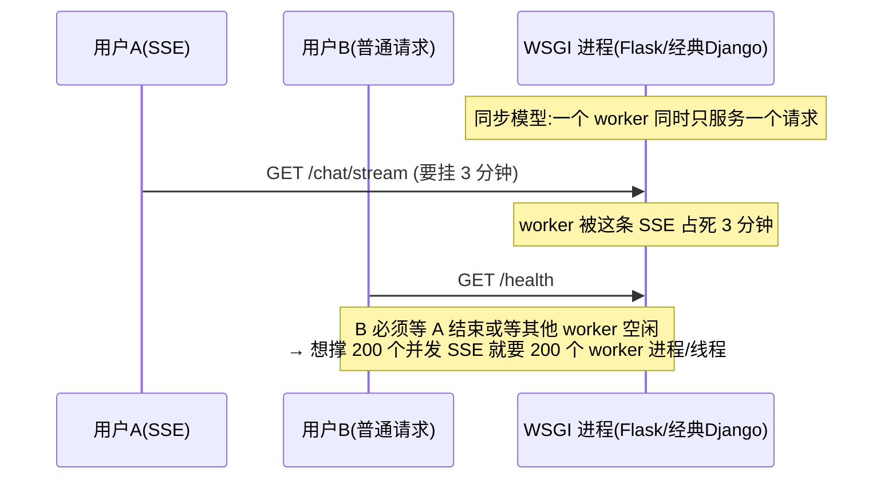
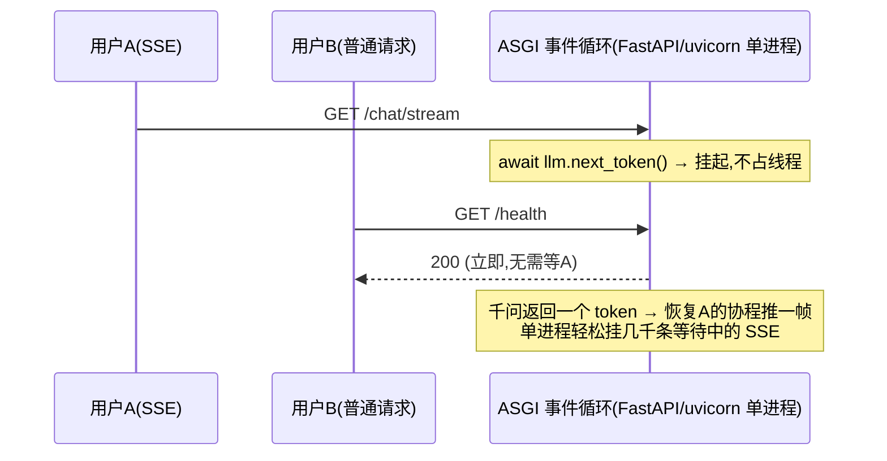

# Web 框架选型：为什么是 FastAPI,而不是 Django / Flask

> Python 重写(feat/python-rewrite)的框架决策报告。结论先行:**这不是"哪个框架更好"的信仰题,
> 而是"本服务的负载画像需要什么"的匹配题**——agent-server 是一个 SSE 长连接 + 全程 await 外部
> 服务(LLM/Milvus/PG)的 IO 密集微服务,这个画像几乎逐条命中 FastAPI 的长处、Django/Flask 的短处。
> 面向零背景读者,术语表先行,附逐维度对比与"什么时候该反过来选 Django/Flask"。

---

## 1. 术语表

| 名词 | 大白话解释 |
|---|---|
| **WSGI** | Python Web 的老标准接口(2003):**一个请求占一个线程/进程,同步阻塞**处理完才放手。Flask/Django 传统模式跑在它上面。 |
| **ASGI** | 新标准(2018+):基于事件循环的**异步**接口,一个进程能同时挂起成千上万个等待中的请求。FastAPI 原生跑在它上面(常配 uvicorn 服务器)。 |
| **asyncio / await** | Python 的协程机制:代码 `await` 一个网络调用时,线程不傻等,转头去处理别的请求。 |
| **SSE** | Server-Sent Events,服务器向浏览器持续单向推流的长连接。本项目用它推对话 token 流和 run 进度。 |
| **IO 密集** | 大部分时间在等网络(调 LLM、查库),不是在算。本服务一次对话 95% 时间在等千问返回。 |
| **Django** | Python 最大而全的框架:自带 ORM、Admin 后台、模板引擎、用户体系、表单——"电池全含"。 |
| **DRF** | Django REST Framework,Django 做 JSON API 的事实标准插件。 |
| **Flask** | Python 最经典的微框架:只给路由和请求上下文,其余(校验/文档/ORM)全靠自选插件拼。 |
| **FastAPI** | 2018 年出的 ASGI 框架:类型注解驱动(pydantic 校验+OpenAPI 文档自动生成),异步原生。 |
| **OpenAPI** | 描述 REST 接口的标准 JSON(路径/参数/响应结构),可生成文档页和客户端代码。web 端消费本服务靠它对齐契约。 |
| **Litestar** | 更新的 ASGI 框架(FastAPI 的挑战者),支持 msgspec,性能更强但社区规模小得多。 |
| **uvicorn / gunicorn** | 分别是主流的 ASGI / WSGI 服务器(真正监听端口跑框架代码的进程)。 |

---

## 2. 先立靶子:本服务对框架的四条硬需求

从 agent-server 的真实负载倒推(不是抽象比框架):

1. **SSE 长连接是一等公民**:对话流(`/chat` 逐 token 推)和 run 进度流(`/runs/{id}/stream`)是核心体验;一个用户挂着 SSE 可能几分钟。**连接多、每条都在等**——典型的"高挂起、低计算"。
2. **全链路 async**:openai-python 的 async 客户端、redis-py async、SQLAlchemy 2.0 async、Milvus 调用——整条依赖链都是 `await` 风格,框架若不能原生 async,每一层都要打胶水。
3. **OpenAPI 是跨服务契约的一部分**:web 端(及未来消费方)靠接口文档对齐;Node 版用 `@nestjs/swagger` 手工维护,重写后希望"代码即文档"零额外成本。
4. **不需要的东西同样明确**:无服务端模板/页面(纯 API)、无 Admin 后台需求、ORM 已定 SQLAlchemy、用户体系不归它管(JWKS 验 our-chat 签发的 token)。**框架自带这些=纯负重**。

## 3. 核心分野:WSGI 同步模型 vs ASGI 异步模型(原理层)

这是三者最本质的分水岭,直接决定 SSE 和 LLM 等待的成本。

量化感受:200 个并发 SSE,WSGI 需要 ~200 个 worker(每个几十 MB 内存,gunicorn 进程模型);ASGI 单进程 + 事件循环即可,内存是一份。**对"连接都在等 LLM"的本服务,这不是性能优化,是模型对不对的问题。**

> 注:Flask 2+ 允许 `async def` 视图,但它跑在 WSGI 上——每个 async 视图被丢进**一次性事件循环/线程**执行,并发模型仍是"一请求一 worker",SSE 照样占死 worker,属于"语法上支持、模型上没变"。Django 3+ 有 ASGI 模式,但见下节。

## 4. 逐框架分析

### 4.1 Django:电池全含,但电池全是我们用不上的,而 async 恰是它的短板

- **它的价值主张**:ORM + Admin + 模板 + 表单 + 用户体系一体化,建"数据库驱动的网站"(CMS/电商后台)无出其右。
- **对本项目逐条落空**:ORM——我们已定 SQLAlchemy(且 Django ORM 换不掉,是全家桶的地基);Admin——没有运营后台需求;模板——纯 API;用户体系——身份在 our-chat(JWKS 验签),Django 的 User/session/auth 整套用不上。**装进来的每节电池都是维护面,不是能力。**
- **async 现状(短板正中我们要害)**:Django 3+ 支持 ASGI,但 **ORM 的 async 仍靠线程池包装**(`sync_to_async`),信号/中间件生态大量同步;**DRF 至今是同步的**——用 Django 写 JSON API 的标准姿势(DRF)天然不 async。SSE/流式响应在 Django 里是二等公民,`StreamingHttpResponse` + ASGI 可用但生态罕见、踩坑资料少。
- **django-ninja**(Django 上的 FastAPI 仿制层)能补校验/文档,但它恰恰证明了需求方向——**在 Django 里装一个 FastAPI,为什么不直接用 FastAPI**。

### 4.2 Flask:极简起点,但每条硬需求都要自己拼,并发模型不匹配

- **它的价值主张**:五分钟起个路由,极简、灵活、教学友好。
- **对本项目逐条缺失**:校验——无内置,自己拼 marshmallow/pydantic 胶水;OpenAPI——无内置,拼 flask-smorest/apispec;DI——无;**每一块都是"再选一个插件+写胶水"**,拼完的东西约等于一个自建的、无人维护的 FastAPI。
- **并发模型(致命项)**:WSGI 同步,见上节时序图——SSE 占死 worker;要么堆 gunicorn worker(内存线性涨),要么上 gevent 猴子补丁(与 grpc/一些 C 扩展兼容性糟)。async 视图是"假 async"(见上节注)。
- Flask 适合的是:内部小工具、同步短请求、遗留系统——都不是本服务。

### 4.3 FastAPI:四条硬需求逐条原生命中

1. **SSE**:ASGI 原生,`StreamingResponse`/sse-starlette 就是标准姿势,async generator 写推流自然贴合"逐 token"场景。
2. **全链路 async**:路由即 `async def`,与 openai/redis/SQLAlchemy 2.0 的 async 客户端零胶水。
3. **OpenAPI 自动生成**:pydantic 模型即文档,`/docs` 开箱;对比 Node 版还要手贴 `@ApiOperation`,这里是负成本。
4. **不带用不上的电池**:无 ORM/Admin/模板绑定,SQLAlchemy/Milvus/JWKS 各接各的,框架只管 HTTP 层——**尺寸刚好**。
5. 生态与主流度:当下 Python 新建 API 服务的事实默认;AI 圈尤其如此(OpenAI/LangChain 官方示例、几乎所有 LLM 服务模板都是 FastAPI),招人/搜答案/AI 辅助编码的语料都最厚。

**FastAPI 的诚实短板**(不隐瞒):① 单文件框架,核心开发者集中度高(bus factor 议题社区讨论过);② DI 系统比 NestJS 简陋(无模块化容器,复杂图需自律);③ 后台任务只有简易 BackgroundTasks——**与我们无关,重任务已定走 Pulsar+独立 worker**。这些短板没有一条落在本项目的关键路径上。

## 5. 逐维度对比表

| 维度(按本项目权重排序) | FastAPI | Django(+DRF) | Flask |
|---|---|---|---|
| SSE/流式长连接 | ✅ 原生一等 | ⚠️ ASGI 可用但生态二等 | ❌ WSGI 占死 worker |
| 全链路 async 匹配 | ✅ 原生 | ⚠️ ORM 线程池包装,DRF 同步 | ❌ 假 async |
| 校验+OpenAPI 契约 | ✅ 内置(pydantic) | DRF serializer(手写两遍)/ninja | ❌ 全靠插件拼 |
| 与既定组件(SQLAlchemy/JWKS/Pulsar)的耦合自由度 | ✅ 零绑定 | ❌ ORM/auth 深绑,换=对抗框架 | ✅ 零绑定 |
| 用不上的负重 | 无 | Admin/模板/表单/用户体系 | 无 |
| 并发成本(200 SSE) | 单进程事件循环 | ASGI 下可,但组件拖后腿 | ~200 worker 进程 |
| 生态主流度(AI 服务) | ✅ 事实默认 | 大而全但不在 AI 主航道 | 存量大,新项目少 |
| 大团队约束力/全家桶一致性 | 中(靠自律) | ✅ 最强 | 弱 |

**什么时候答案该反过来**(诚实边界):要是这个服务是"带运营后台的内容管理系统"(重 CRUD+Admin+权限矩阵),Django 全家桶是碾压性正确;要是它是"一个同步的内部小工具",Flask 三行起步最合理。框架没有好坏,只有画像匹配。另:Litestar 技术上同样匹配(甚至 DI 更好),不选它纯因社区规模/资料/人才密度与 FastAPI 差一个量级——"主流本身就是工程属性"。

## 6. 结论

**FastAPI。** 决定性理由按权重:①ASGI 异步模型与"SSE 长连接 + 全程等 LLM"的负载画像同构(Django/Flask 在这条上是模型级不匹配,不是调优能解决的);②类型注解一份顶三份(校验/文档/IDE),与已定的"边界 pydantic"策略同一地基;③不绑 ORM/用户体系,与 SQLAlchemy/JWKS/Pulsar 的既定选型零冲突;④AI 服务生态的事实标准,语料与人才密度最厚。Django 的全部王牌(ORM/Admin/全家桶)在本项目恰好全部用不上,Flask 则是"把 FastAPI 已内置的东西自己再拼一遍且并发模型还不对"。

> 关联文档:《边界校验策略-pydantic守边界-内部素Python》(校验分层,与本选型共用 pydantic 地基)、
> 《用Python全面重写agent-server的技术利弊分析》(重写总账)、《双进程架构-HTTP与Worker-深度讲解》
> (worker 侧不经框架,Pulsar consumer 独立进程,故本选型只关乎 HTTP 层)。
