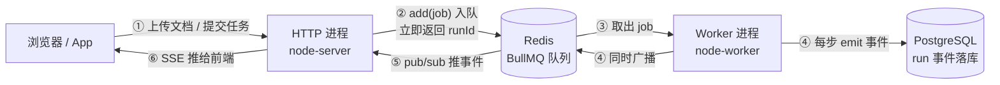
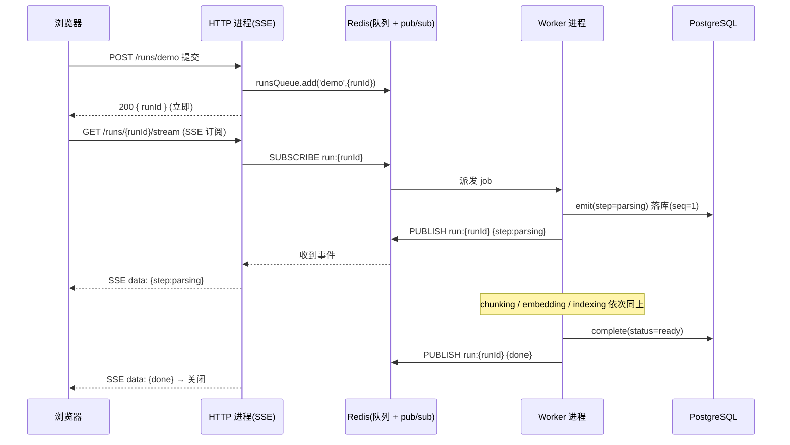
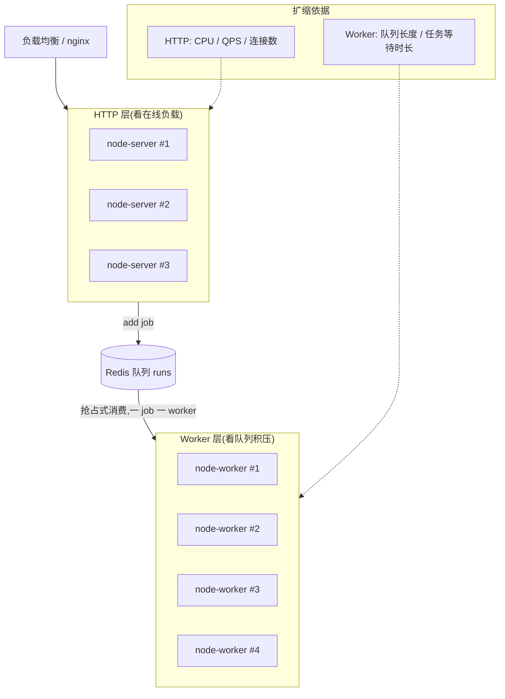
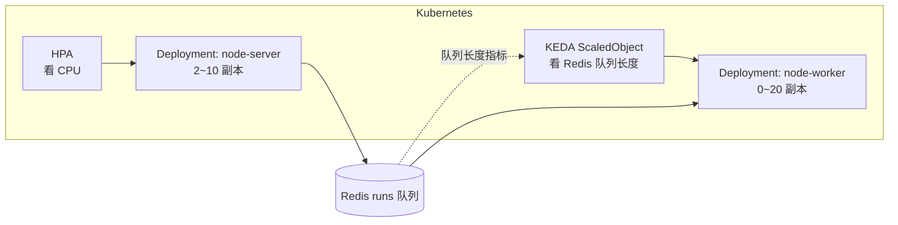

# agent-server 双进程架构（HTTP 进程 + Worker 进程）深度讲解

> 面向零背景工程师：读完能理解"为什么把一个 NestJS 服务拆成 HTTP 和 Worker 两个进程、它怎么跑、
> 两者能不能各自弹性扩缩容、还有哪些替代方案、代价在哪"。所有例子落到 agent-server 的真实代码。

---

## 1. 术语表（正文用到的名词，先扫一眼）

| 名词 | 一句话大白话 |
|---|---|
| **进程（process）** | 操作系统运行一份程序的独立实例，有自己的内存空间；两个进程互不共享内存。 |
| **HTTP 进程 / node-server** | 处理网页/App 发来的请求、返回响应、维持 SSE 长连接的那个进程（`node dist/main`）。 |
| **Worker 进程 / node-worker** | 不监听端口、只从队列里取任务后台跑的那个进程（`node dist/main.worker`）。 |
| **事件循环（event loop）** | Node.js 单线程调度模型：一个进程一根主线程轮流处理任务；一段同步重活会卡住整根线程。 |
| **队列（queue，本项目用 BullMQ）** | 一个"待办任务列表"，存在 Redis 里。生产者往里塞任务，消费者从里取任务。 |
| **生产者 / 消费者** | 生产者 = 把任务塞进队列的人（这里是 HTTP 进程）；消费者 = 从队列取任务干活的人（Worker 进程）。 |
| **作业 / job** | 队列里的一条任务，带载荷（payload）。本项目载荷只有 `{ runId, userId }`。 |
| **run** | 一次可追踪的执行（文档摄取或 agent 任务），状态与事件以数据库为准。 |
| **RunEngine** | 项目里统一"记录 run 每一步事件"的模块：每步既写数据库、又往 Redis 广播。 |
| **SSE（Server-Sent Events）** | 服务器单向持续往浏览器推消息的长连接（比 WebSocket 简单，只服务器→客户端）。 |
| **Redis pub/sub** | Redis 的发布订阅：一个进程 `publish` 到某频道，所有 `subscribe` 该频道的进程都收到。 |
| **at-least-once（至少一次）** | 队列的投递语义：一个任务至少被处理一次，异常时会重试，因此可能被处理多次 → 任务要**幂等**。 |
| **幂等（idempotent）** | 同一个任务重复执行多次，最终结果和执行一次一样（不会重复扣款、不会插两条）。 |
| **横向扩容 / 纵向扩容** | 横向 = 多开几个副本分摊；纵向 = 给单个副本更多 CPU/内存。 |
| **优雅退出（graceful shutdown）** | 进程收到停止信号后，先把手头任务处理完、连接关干净，再退出，而不是当场断。 |
| **HPA / KEDA** | Kubernetes 里的自动扩缩容器：HPA 按 CPU 等指标；KEDA 能按"队列长度"这种业务指标扩缩、甚至缩到 0。 |

---

## 2. 为什么存在：不拆会怎样（动机在机制之前）

agent-server 干的活里有一类是**又慢又重**的：一次"文档摄取"要顺序做 **解析 → 分块 → 调用大模型生成 embedding 向量 → 写入 Milvus 向量库**；一次 agent 任务要反复调用大模型（LLM）推理、调工具。这类活单次耗时从**几秒到几分钟**，且吃 CPU/内存/网络。

设想**最朴素的写法**：在 HTTP 接口里同步把这些活干完再返回。会具体坏在四个地方：

1. **卡死事件循环、拖垮所有请求**。Node.js 一个进程只有一根主线程跑事件循环——大白话说，它像一个只有一个窗口的银行柜台。文档解析/分块这种 CPU 重活一旦在柜台上办，**后面所有请求全排队**，健康检查、别人的登录、别的对话统统变慢甚至超时。即便 LLM 调用是等待 IO（`await` 不占 CPU），把一个 5 分钟的任务绑在一次 HTTP 请求上，也会长时间占用连接。

2. **请求超时、体验崩坏**。浏览器、nginx、负载均衡器都有几十秒级的超时。一个 3 分钟的摄取任务，客户端早断了，用户只看到"请求失败"，可后台其实还在跑——状态彻底错乱。

3. **不可靠、任务易丢**。同步做，如果进程这时崩了/被重启(部署)，这次任务就**凭空消失**，没有重试、没有记录。对"上传的文档要建索引"这种事，丢了就是数据不一致。

4. **无法按负载各自扩缩**。在线请求的负载（并发连接数、QPS）和后台任务的负载（队列积压、任务吞吐）是**两条完全不同的曲线**：白天用户多、请求高峰；有人批量上传 100 个文档时，是后台任务高峰，但在线请求可能很闲。绑在一个进程里，你只能按"两者的最大值"堆资源，钱花在刀背上。

**双进程架构就是针对这四点的解**：把"接请求、立刻回、持有推送连接"留给 **HTTP 进程**；把"慢重活"扔进**队列**，由独立的 **Worker 进程**异步、可靠、可重试地消费。HTTP 进程从此只做轻快的事，永远低延迟高并发。

---

## 3. 机制拆解：它到底怎么跑

### 3.1 最简心智模型（先记住这一张）



一句话：**HTTP 进程收活即入队秒回，Worker 进程后台慢慢干、每干一步就落库+广播，HTTP 进程订阅广播再用 SSE 把进度推回前端。** 两个进程从不直接对话，全靠中间的 Redis（传任务、传事件）和 PostgreSQL（存权威状态）。

### 3.2 关键设计：同一份镜像，两个入口

两个进程**不是两套代码**，是**同一个构建产物、用不同入口启动、装不同的模块**：

| | HTTP 进程 | Worker 进程 |
|---|---|---|
| 启动命令 | `node dist/main` | `node dist/main.worker` |
| 创建方式 | `NestFactory.create(AppModule)`（**开端口**） | `NestFactory.createApplicationContext(WorkerModule)`（**不开端口**） |
| 装什么 | 所有 Controller（HTTP 路由、SSE） | 只装 `@Processor` 消费者 + 摄取/agent 服务，**无 Controller** |
| 角色 | 生产者：`runsQueue.add(...)` | 消费者：`RunProcessor.process(job)` |

真实代码印证——Worker 入口 `main.worker.ts` 用的是 `createApplicationContext`（只起依赖注入容器、不监听 HTTP），注释写得很明白："用 createApplicationContext 起一个**无 HTTP 监听**的 Nest 上下文……@Processor 随之创建 BullMQ Worker 开始消费 runs 队列……可独立伸缩"。而 `WorkerModule` 的 providers 只有 `RunProcessor / IngestionService / AgentRunnerService / ToolRegistry`，**一个 Controller 都没有**。

> 为什么用同一镜像而不是拆两个仓库/两个镜像？→ 构建一次、代码复用（RunEngine、LLM、Milvus 这些 shared 模块两边都要用）、版本永远一致。代价是"镜像里装了对方用不到的代码"，但对 Node 服务这点体积可忽略。这是**刻意的简化取舍**。

### 3.3 生产者一侧：入队即返回（HTTP 进程）

`runs.controller.ts` 里注入了队列，提交任务时只做两件事——建一条 run、把 job 塞进队列，然后**立刻**把 runId 还给前端：

```ts
@InjectQueue(RUNS_QUEUE) private readonly runsQueue: Queue<RunJobData>
// ...
await this.runsQueue.add('demo', { runId: run.runId, userId: user.userId });
return { runId: run.runId };   // 不等任务跑完,立即返回
```

注意载荷 `RunJobData` 只有 `{ runId, userId }`——**不带业务数据**。设计上"业务状态以 DB 的 Run 为准"：队列只负责"通知有活要干、活的编号是多少"，真正的内容 Worker 拿 runId 去数据库查。这样即使队列消息很小、也不怕消息与数据库不一致。

### 3.4 消费者一侧：按 job 名分派（Worker 进程）

`run.processor.ts` 的 `@Processor(RUNS_QUEUE)` 让 NestJS 在 Worker 进程里创建一个 BullMQ Worker 盯住 `runs` 队列。核心 `process(job)`：

```ts
async process(job: Job<RunJobData>) {
  const { runId } = job.data;
  const run = await this.runEngine.getRun(runId);   // 拿 runId 回查权威状态
  try {
    await this.runEngine.start(runId);              // 标记 running + 广播
    switch (job.name) {                             // 按入队时的 job 名分派
      case 'ingestion': await this.ingestion.ingest(run); await this.runEngine.complete(runId,'ready'); break;
      case 'agent':     await this.agent.run(run);        await this.runEngine.complete(runId,'done');  break;
      default:          await this.runDemo(runId);        await this.runEngine.complete(runId,'done');
    }
  } catch (err) {
    await this.runEngine.fail(runId, msg);
    throw err;   // 关键:抛回给 BullMQ,由它记失败/触发重试
  }
}
```

两个要点：
- **按 `job.name` 分派而非 run.kind**——注释解释：真实 agent 任务和 demo 的 `kind` 都是 `agent_task`，只能靠入队时的 job 名（`ingestion`/`agent`/`demo`）区分。这是很实际的一个细节。
- **失败时 `throw err`**——不是吞掉，而是抛回 BullMQ，让队列去做"重试计数/进死信"。这正是"可靠"的来源：任务失败不是消失，是被队列记账。

### 3.5 进度怎么实时回到前端：Redis pub/sub + SSE

这是双进程里最容易被忽略、却最关键的一环。Worker 和 HTTP 是**两个不同进程**（生产上甚至是两台机器），Worker 算出的进度**没法直接塞进** HTTP 进程持有的那条 SSE 连接。桥梁是 Redis pub/sub：

- Worker 每完成一步，`RunEngine.emit(runId, ...)` 干两件事：**① 把事件写进 PostgreSQL**（带自增 sequenceNo，事件溯源），**② 往 Redis 频道 `run:{runId}` 广播**。
- HTTP 进程的 SSE 接口 `@Sse(':runId/stream')` **订阅** `run:{runId}` 频道，收到就转成 SSE 推给浏览器。
- 断线重连还能补：SSE 接口支持 `getEventsSince(runId, sinceSeq)`，从数据库把"你断线期间漏掉的事件"补发——因为事件都落库了，这是事件溯源带来的白捡好处。



---

## 4. 一个贯穿始终的具体例子：上传一个 PDF

假设用户上传 `report.pdf`，建了一条 `runId = r_9f3a`、`kind = ingestion`：

1. **HTTP 进程**：`runsQueue.add('ingestion', { runId: 'r_9f3a', userId: 42 })` → 队列里多了一条 job（Redis 里 `bull:runs:...` 键）；接口**立即**返回 `{ runId: 'r_9f3a' }`。用户界面拿到 runId，马上发起 SSE `GET /api/runs/r_9f3a/stream`，HTTP 进程 `SUBSCRIBE run:r_9f3a`。此刻 Worker 可能还没开始，用户看到的是"排队中"。
2. **Worker 进程**：BullMQ 把这条 job 交给某个空闲 Worker。`process` 拿到 `runId='r_9f3a'` → 查库得到 run → `start('r_9f3a')`（状态 queued→running，广播）。
3. `ingestion.ingest(run)` 内部按步走，每步 `emit`：
   - `emit('r_9f3a','step',{step:'parsing'})` → 写库 seq=1 + `PUBLISH run:r_9f3a`。HTTP 进程收到 → SSE 推 `{step:'parsing'}`，用户看到"解析中"。
   - `chunking`（seq=2）→ 用户看到"分块中"。
   - `embedding`（seq=3）→ Worker 这一步调用**千问 LLM** 把每个文本块转成 1024 维向量（这是最慢、最吃网络的一步，正是当初要拆出去的原因）。
   - `indexing`（seq=4）→ 向量写入 **Milvus**。
4. **完成**：`complete('r_9f3a','ready')` → 广播 `{done}` → SSE 推给用户"已就绪"，前端关闭 SSE。
5. **假设第 3 步 embedding 时千问超时报错**：`process` 的 catch 里 `fail('r_9f3a', 'LLM timeout')` 落库失败事件 + `throw err`。BullMQ 记一次失败，按配置**重试**（比如再排一次队）。用户的 SSE 会收到失败事件，或重试成功后继续。**关键：整个过程 HTTP 进程一直轻快——它自始至终只做了"入队一次 + 转发几条 SSE"，没碰解析/embedding/写库这些重活。**

---

## 5. 核心问题：HTTP 和 Worker 能各自独立弹性扩缩容吗？怎么用？

**能，而且这正是拆两个进程最大的收益之一。** 因为它俩是独立进程、通过 Redis 队列解耦，各自的副本数互不影响；BullMQ 保证**同一条 job 只会被一个 Worker 消费**，所以 Worker 想开几个开几个，不会重复处理。

### 5.1 扩缩容的两个维度



- **HTTP 层**按"在线请求压力"扩：CPU、每秒请求数（QPS）、并发 SSE 连接数。
- **Worker 层**按"后台积压"扩：队列里等待的 job 数、任务平均等待时长。
- 两条曲线不同步：有人批量传 100 个文档时，队列暴涨→只需加 Worker，HTTP 层纹丝不动；晚高峰在线聊天多时，只需加 HTTP，Worker 可能闲着。

### 5.2 具体怎么操作

**A. docker-compose（当前部署形态）** —— 两者本就是独立 service、同镜像不同 `command`，直接指定副本数：
```bash
# 后台任务积压时，把 worker 开到 4 个副本，HTTP 保持 2 个
docker compose -f docker/docker-compose.prod.yml up -d \
  --scale node-worker=4 --scale node-server=2
```
> 注意当前 compose 给容器写了固定 `container_name`（如 `agent-node-worker`），多副本前需去掉固定名（否则名字冲突）。这是从"单机单副本"走向"多副本"要改的一处。

**B. Kubernetes（要真弹性时的目标形态）** —— 拆成两个 Deployment，各挂各的自动扩缩：
- `node-server` Deployment + **HPA**：按 CPU/QPS 扩缩。
- `node-worker` Deployment + **KEDA ScaledObject**：直接**按 Redis 里 `runs` 队列长度**扩缩——队列越长开越多 worker，队列空了甚至**缩到 0**（scale to zero，省钱），来任务再拉起。这是 HPA 原生做不到、KEDA 专门解决的"按业务指标扩缩"。



**C. 单副本内还能再压榨（纵向 + 进程内并发）**：BullMQ 的 Worker 有 `concurrency` 参数——一个 Worker 进程内**同时处理 N 个 job**（因为大多时间在 `await` LLM/IO，不占 CPU，可以并发好几个）。所以"加吞吐"有三档：调大单 worker 的 `concurrency`（进程内并发）→ 加 worker 副本（横向）→ 给副本更多资源（纵向）。**优先调 concurrency 和加副本**，因为任务是 IO 密集。

> 一句话使用建议：**HTTP 副本看 CPU/连接、Worker 副本看队列长度**；能上 K8s 就用 KEDA 让 Worker 按队列自动扩缩（含缩到 0）；上不了 K8s 就手动 `--scale`。

---

## 6. 取舍与业界对比：还有哪些解法，凭什么选这个

先把"处理长任务"这件事的所有主流解法摆开：

| 方案 | 额外基础设施 | 任务可靠性 | HTTP/Worker 独立扩缩 | 复杂度 | 适合任务时长 | 代表 |
|---|---|---|---|---|---|---|
| ① HTTP 里同步做 | 无 | 无（崩了就丢） | ❌ 绑死 | 最低 | < 1s | 任何朴素后端 |
| ② 同进程内后台异步（`setImmediate`/内存队列） | 无 | 无（重启即丢、不跨副本） | ❌ | 低 | 秒级、可丢 | 小工具 |
| ③ 同进程既 serve HTTP 又跑 BullMQ Worker | Redis | 有（队列持久化） | ❌ 仍绑死，重活和请求抢同一事件循环 | 低 | 秒~分 | 小型项目起步 |
| ④ **独立 Worker 进程 + BullMQ（本项目）** | Redis | 有（at-least-once + 重试） | ✅ 各自副本 | 中 | 秒~分钟 | 中型 Node 服务、本项目 |
| ⑤ 托管队列 + Serverless（SQS→Lambda / Pub/Sub→Cloud Run / Cloud Tasks） | 云队列 + FaaS | 高（云托管、自动重试/死信） | ✅ 天生按消息扩缩、缩到 0 | 中（但绑定云） | 秒~分钟 | 云原生团队 |
| ⑥ 专用工作流引擎（Temporal / AWS Step Functions） | 引擎集群 | 最高（持久化执行、断点续跑、可见性一流） | ✅ | 高 | 分钟~天、多步长流程 | 复杂编排、金融/履约 |
| ⑦ 其他语言生态同构方案（Python Celery / Ruby Sidekiq / Java Spring @Async+MQ） | Redis/RabbitMQ | 有 | ✅ | 中 | 秒~分 | 各语言等价物 |

选 ④ 的理由，就是**在"可靠 + 能独立扩缩"和"别把架构搞太重"之间取平衡**：
- 比 ①②③**多了可靠性和独立扩缩**（这是硬需求：文档索引不能丢、批量上传要能单独加 worker）。
- 比 ⑤**不绑定云厂商**、本地/自建服务器都能跑（本项目正是自建服务器 + docker-compose），且沿用已在用的 Redis，不引入新托管服务。
- 比 ⑥**不引入 Temporal 这种重型引擎**：当前任务是"单条 run 内几步顺序执行"，还没到"跨服务、跨天、需要断点续跑和复杂补偿"的编排复杂度，上 Temporal 是**over-engineering**。等哪天 agent 任务变成"十几步、要人工审批、要长期等待外部回调"的长流程，再考虑 ⑥ 才划算。
- 和 ⑦ 是**同一思想的不同语言实现**：Celery 之于 Python、Sidekiq 之于 Ruby，就是 BullMQ 之于 Node。选 BullMQ 是因为技术栈是 Node，且它原生支持重试/延迟/优先级/并发。

**什么时候不该用 ④**：任务恒定 < 100ms（同步做就好，别为它架队列）；或任务多到需要 Kafka 那种百万级吞吐的流式处理（BullMQ 是任务队列不是消息流，超大吞吐该换 Kafka/流处理）。

---

## 7. 踩坑：三个最常见的事故模式

### 7.1 任务不幂等 + 重试 = 重复副作用
- **触发**：Worker 处理到一半崩了/超时，BullMQ 按 at-least-once **重试**整个 job；如果 `ingest` 里"写向量到 Milvus"不是幂等的，重试就会**写入两份重复向量**、或"扣费类"操作扣两次。
- **后果**：数据重复、金额错误，且难复现。
- **排查/防治**：任务设计成**幂等**——先按 runId 删旧结果再写、或写入带唯一键做去重；把"完成到第几步"记进 run 事件（本项目有 sequenceNo 事件溯源，天然利于断点判断）。上线前主动 kill 一个处理中的 worker 验证重试后结果是否仍正确。

### 7.2 Worker 不优雅退出 = 部署时任务被腰斩
- **触发**：部署/缩容时直接 `kill` worker，正在跑的 job 被硬生生中断。
- **后果**：run 卡在 `running` 永不完成；或任务被判失败后重试，叠加 7.1 的重复风险。
- **排查/防治**：Worker 入口已 `app.enableShutdownHooks()`（收到 SIGTERM 优雅关闭 BullMQ Worker 与连接）——**这是刻意为之**。部署时给足优雅退出的宽限期（K8s 的 `terminationGracePeriodSeconds` 要 ≥ 单个任务最长耗时，或让 BullMQ 停止领新活、把手头活跑完再退）。别用 `kill -9`。

### 7.3 多副本下用"进程内存"传进度，SSE 收不到
- **触发**：图省事把 Worker 的进度用"进程内事件/内存变量"传给 SSE，而不是走 Redis pub/sub。单机单副本时能用，一旦 Worker 和 HTTP 是不同进程/不同机器，**HTTP 进程根本收不到另一个进程内存里的东西**，前端进度条永远不动。
- **后果**：功能"在我机器上好好的"，一上多副本就假死。
- **排查/防治**：进度必须走**跨进程通道**（本项目正确地用了 Redis pub/sub `run:{runId}` + 事件落库补发）。测试时至少起 2 个 HTTP 副本 + 2 个 worker 副本，验证"连在 A 副本的 SSE 能收到 B worker 的进度"。

---

## 8. 一句话总结

agent-server 把服务拆成 **HTTP（接请求秒回 + 持有 SSE 转发进度）** 和 **Worker（从 Redis 队列取长任务后台可靠地跑）** 两个进程，中间用 **Redis（传任务 + 广播进度）** 和 **PostgreSQL（事件溯源存权威状态）** 解耦。这换来三件事：**在线请求永远低延迟**、**长任务可靠不丢可重试**、**两层能按各自的负载曲线独立弹性扩缩**（Worker 尤其适合按队列长度用 KEDA 自动扩缩甚至缩到 0）。代价是多了一个进程和 Redis 依赖、以及必须处理"幂等/优雅退出/跨进程传进度"这几个分布式细节——在中型 Node 服务这个体量上，这笔账非常划算。

---

## 附：关键源码位置

| 文件 | 角色 |
|---|---|
| `apps/node-server/src/main.ts` | HTTP 进程入口（`NestFactory.create`，开端口） |
| `apps/node-server/src/main.worker.ts` | Worker 进程入口（`createApplicationContext`，不开端口 + 优雅退出） |
| `apps/node-server/src/worker.module.ts` | Worker 根模块（只装 Processor + 服务，无 Controller） |
| `apps/node-server/src/shared/queue/queue.module.ts` | BullMQ 连接与 `runs` 队列注册 |
| `apps/node-server/src/modules/runs/runs.controller.ts` | 生产者：`runsQueue.add` 入队 + SSE `@Sse` 转发 |
| `apps/node-server/src/modules/runs/run.processor.ts` | 消费者：`@Processor(runs)`，按 job.name 分派 + 失败 rethrow 重试 |
| `docker/docker-compose.prod.yml` | `node-server` 与 `node-worker` 两 service，同镜像不同 `command` |
