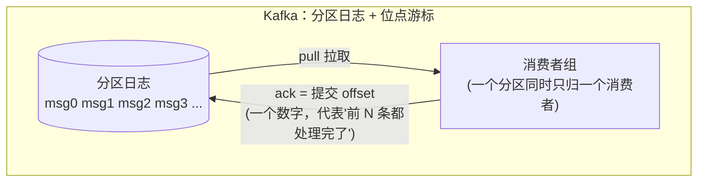
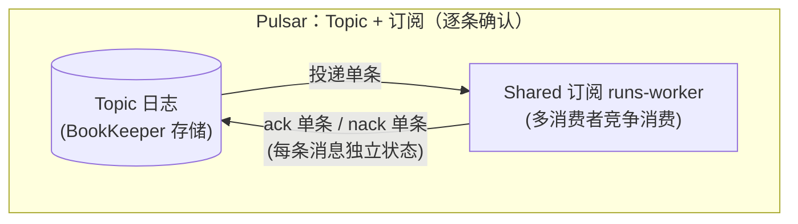
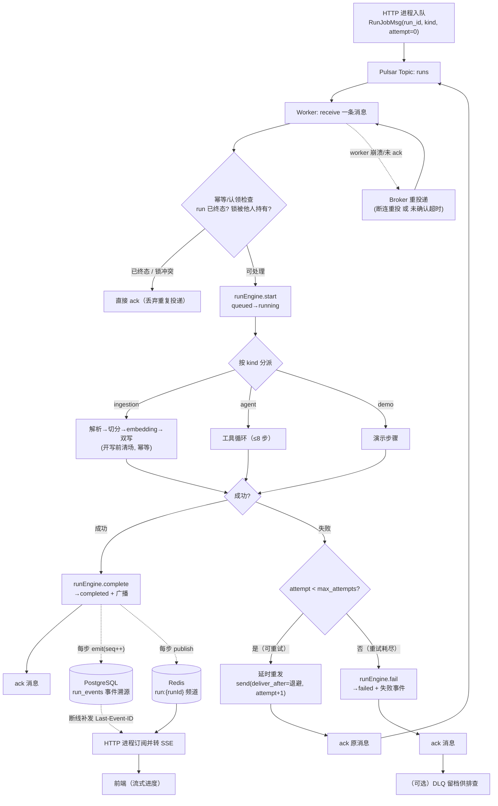
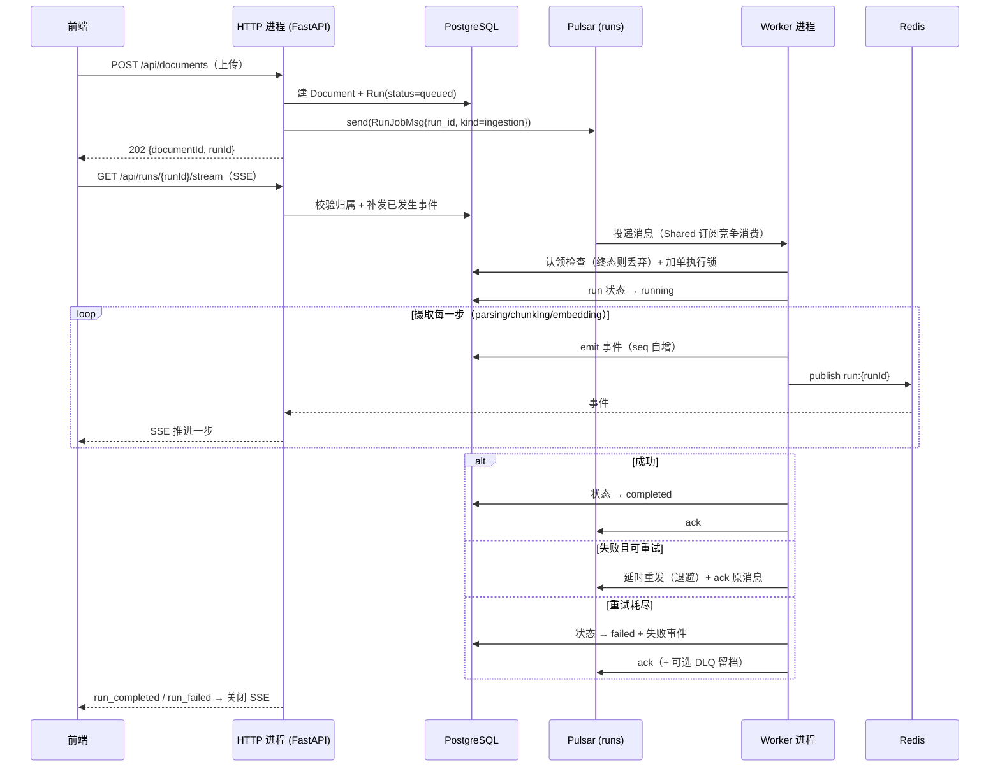

# 消息队列选型：Kafka 还是 Pulsar —— 裸 MQ 上自建任务队列语义

> 背景：Python 重写（feat/python-rewrite）已决定**不再用任务队列库**（BullMQ / Celery / arq 这类
> "消息队列 + 任务语义"的应用层封装），改为**直接用裸消息队列 + 自建任务队列语义**。
> 本文只回答一个问题：这个"裸 MQ"选 **Kafka** 还是 **Pulsar**。
>
> **结论先行：Pulsar**（条件式推荐，见 §7）——它把"任务队列"最难的几块原语（逐条 ack、延迟投递、
> 断连重投、竞争消费）做成了订阅模型的一等公民，我们自建的只剩"策略层"（重试次数/退避/DLQ 终局）。
> Kafka 是"资源最省的安全牌"，但在本项目"长任务 + 并发消费 + 逐条确认"的画像下，
> 需要自建的部分多一个数量级，且有一个结构性冲突（长任务 vs 位点/poll 模型，见 §5）。
>
> 本文取代《用Python全面重写agent-server的技术利弊分析》§3.4/§4.1 中队列部分的初步判断（Celery/arq 讨论）。
> 面向零背景读者：术语表先行；所有结论落到 agent-server 的真实代码与真实部署（单机 7.4 GiB，见《对外入口方案对比》）。

---

## 1. 术语表

| 名词 | 大白话解释 |
|---|---|
| **MQ（消息队列）** | 一个"存消息、等别人来取"的中间件。生产者往里放，消费者从里取。 |
| **任务队列** | MQ 之上再包一层"任务语义"的库（BullMQ/Celery/arq）：入队、取活、干完标记、失败重试、死信……本质仍是 MQ 的应用层封装。 |
| **topic（主题）** | 消息的分类管道。本项目就一个：`runs`（摄取/agent/demo 共用）。 |
| **producer / consumer** | 生产者（入队的一方，本项目的 HTTP 进程）/ 消费者（取活干的一方，worker 进程）。 |
| **partition（分区）** | Kafka 把 topic 切成若干分区并行；Pulsar 的 topic 也可分区，但我们量级不需要。 |
| **offset（位点）** | Kafka 的消费进度：一个数字，"这个分区我读到第几条了"。ack 的实质是**推进这个数字**。 |
| **订阅（subscription）** | Pulsar 的概念：topic 之下可以有多个独立订阅，每个订阅有自己的消费进度；同一订阅的多个消费者竞争消费。 |
| **Shared 订阅** | Pulsar 四种订阅类型之一：多个消费者挂同一订阅，消息**轮询分发**，每条只给一个消费者——等价于 Kafka 的消费者组。 |
| **ack / nack** | 确认 / 否认。ack = "这条我处理完了"；nack = "这条失败了，请再给我一次"。 |
| **at-least-once（至少一次）** | 投递语义：不丢，但可能重复。任务必须**幂等**（重复执行结果一样）。 |
| **幂等（idempotent）** | 同一任务执行多次，最终结果与执行一次相同（本项目摄取靠"开写前清场"实现）。 |
| **DLQ（死信队列）** | 重试耗尽的失败消息的去处：不丢、不再自动重试，留档供人工排查。 |
| **retry letter topic** | Pulsar **Java 客户端**的延迟重试机制（`reconsumeLater`）：失败消息带"已重试次数"进重试主题，延迟后再投递。**Python 客户端没有这个 API**（见 §5.3）。 |
| **ack timeout / 未确认超时** | "消息发给你 N 秒还没 ack，就当你在处理中失联，重新投给别人"。相当于任务队列的 **visibility timeout / 锁超时**。Pulsar 里叫 `unacked_messages_timeout_ms`（Python），默认关闭。 |
| **delayed delivery（延迟投递）** | 发送时指定"30 秒后再投递这条消息"。Pulsar 原生支持（`deliver_after`），Kafka **没有**。 |
| **max.poll.interval.ms** | Kafka 消费者"两次拉取之间的最长间隔"，默认 5 分钟；超了就被踢出组、触发 rebalance。**长任务是它的天敌**。 |
| **rebalance（再均衡）** | Kafka 消费者组增删成员时重新分配分区，期间消费停顿。 |
| **backlog / lag** | 积压：还没被消费的消息数（Pulsar backlog / Kafka consumer lag），是扩缩容的观测指标。 |
| **JVM 堆 / 直接内存** | Java 进程的内存参数（`-Xmx` 堆上限、`MaxDirectMemorySize` 堆外上限）。Kafka/Pulsar 都是 JVM 中间件，**内存占用是选型硬约束**（本项目单机 7.4 GiB）。 |
| **KRaft** | Kafka 3.0+ 的去 ZooKeeper 模式；**Kafka 4.0 起只支持 KRaft**，单进程即一个单节点集群。 |
| **BookKeeper** | Pulsar 的存储层（消息写进 BookKeeper 的 ledger）。standalone 模式下与 broker 同进程。 |

---

## 2. 先立靶子：本项目对"任务队列"的真实需求（从代码倒推，不空谈）

### 2.1 现状：BullMQ 到底被用成了什么样

全仓库只有 3 个入队点、1 个消费者，载荷都是**指针消息**（只有定位信息，业务状态以 DB 的 Run 为准）：

| 位置 | 入队时机 | job 名 | 载荷 |
|---|---|---|---|
| `documents.service.ts:89` | 用户上传文档后 | `ingestion` | `{ runId, userId }` |
| `agent.controller.ts:45` | 用户提交 agent 任务 | `agent` | `{ runId, userId }` |
| `runs.controller.ts:49` | demo 接口 | `demo` | `{ runId, userId }` |
| `run.processor.ts` | 消费端 | 按 `job.name` 分派 | `start → 分派 → complete/fail`，失败 `throw` 交回队列 |

**实际语义比文档描述的还朴素**：全仓库 grep 不到 `attempts` / `defaultJobOptions` / `concurrency` / `delay`
任何配置——也就是说现状是"**单次尝试、单并发**"，失败就 `run.fail` 落库，没有自动重试。
进度推送**不走队列**：走 `RunEngine.emit`（PG 事件溯源 + Redis pub/sub），这套**保持不变**，与 MQ 选型正交。

### 2.2 "自建任务队列"必须实现的能力清单

| # | 能力 | 现状对应 | 为什么需要 |
|---|---|---|---|
| 1 | 入队（生产） | `runsQueue.add(name, data)` | 三个入口共用 |
| 2 | 竞争消费（多 worker 副本） | BullMQ Worker 抢占 | 未来 worker 多副本/多机（《双进程架构》§5） |
| 3 | 单条完成确认（ack） | BullMQ 隐式 | 干完才能丢；并发消费时必须**逐条**可确认 |
| 4 | 失败重投（退避 + 上限） | 未配置（裸奔） | 网络抖动（embedding 超时）应能自动重试 |
| 5 | 死信（DLQ → run.fail） | 无 | 重试耗尽的失败不能无声消失 |
| 6 | 长任务在途 + 崩溃恢复 | BullMQ 锁 + stalled 检测 | 一次摄取几分钟；worker 崩了任务必须能被重投 |
| 7 | 幂等（at-least-once） | 摄取"开写前清场" | 重投/重复投递下结果不重复 |
| 8 | 积压可观测（扩缩容依据） | BullMQ 队列长度 | KEDA 按队列长度扩缩（《双进程架构》§5.2） |
| 9 | 优雅退出 | `enableShutdownHooks()` | 部署时在途任务不被腰斩 |
| 10 | （可选）延迟消息 | BullMQ delay | 重试退避；未来"定时任务" |

### 2.3 明确"不需要"的（避免被吞吐参数带偏）

- **不需要高吞吐**：真实量级 = 日均几十~几百条、突发百条（批量上传）；两个 MQ 的吞吐都过剩 4~6 个数量级。
- **不需要顺序**：每个 run 独立，消息之间无因果；同 run 只有一条消息（重试是它的后继，见 §8）。
- **不需要 exactly-once / 事务 / 跨机房复制 / 流处理**：权威状态在 PG，MQ 只是"有活干"的通知管道。
- **不需要优先级 / 定时 cron**：现状没用，近期也用不上。

> 结论：**选型不看吞吐，看"任务语义原语齐不齐、自建代码少不少、单机养不养得起"**。

### 2.4 为什么放弃任务队列库（一句话背景）

任务队列库 = MQ + 任务语义封装，而 BullMQ 的 Redis 私有数据结构**没有 Python 消费者实现**（跨语言断点）；
既然换语言必须换队列，索性直接站到 MQ 这一层，把任务语义握在自己手里（可控、可解释、跨语言可消费）。

---

## 3. 两种 MQ 的本质模型差异（原理层）

### 3.1 Kafka：分布式提交日志 + 位点游标

Kafka 把消息当**日志**：append-only，分区内有序。消费者的"消费"动作 = 记住自己读到哪了（offset）。
**消息没有个体状态**——没有"这条已确认"这回事，只有"我这个组读到第几条了"。



推论（本项目的痛点全从这里来）：
- **并发消费 + 逐条确认**要在应用层自己维护"已完成消息的最高连续位点"（不能把后面的 offset 提交到前面还在途的消息之上）。
- 失败重试没有原语：要么**原地阻塞重试**（占住分区，受 `max.poll.interval.ms` 约束），要么**转发到 retry topic**（§5.2，自建一整套）。
- 没有延迟投递：重试退避要靠 retry topic + 定时消费者模拟。

### 3.2 Pulsar：Topic + 订阅（逐条确认）

Pulsar 把消息当**消息**：topic 是持久日志（BookKeeper），但**消费进度挂在订阅上**，且**每条消息有独立的确认状态**。
任务队列需要的原语（ack/nack/超时重投/延迟投递）都是订阅模型的一等公民：



### 3.3 一句话分野

> **Kafka：你能"推进一个位点"；Pulsar：你能"处置每一条消息"。**
> 任务队列的本质就是"逐条处置"，所以 Pulsar 的原语贴合度高一个层次——这是本文最重要的判断。

---

## 4. 逐维度对比（按本项目权重排序）

| # | 维度 | Kafka | Pulsar | 本项目判定 |
|---|---|---|---|---|
| 1 | **任务语义原语**（逐条 ack / 延迟重投 / 延迟投递 / DLQ） | 只有位点；重试/DLQ 全自建（retry topic 模式） | 逐条 ack ✅、nack 延迟重投 ✅、延迟投递 ✅、DLQ 兜底 ✅ | **Pulsar 胜** |
| 2 | **长任务在途 + 崩溃恢复** | 受 `max.poll.interval.ms` 约束（默认 5min），要调参/pause/心跳；"活着但卡死"不自动收回 | 消息在途直到 ack；消费者断连→未 ack 消息自动重投；可配未确认超时兜底 | **Pulsar 胜** |
| 3 | **并发消费下的确认** | 需自维护"最高连续完成位点"，细节多、易错 | 逐条 ack，天然支持 | **Pulsar 胜** |
| 4 | **自建代码量** | retry topic 链 + attempt 计数 + 延迟调度 + 位点管理，约上千行 | 策略层（attempt/退避/DLQ 终局）约两三百行 | **Pulsar 胜** |
| 5 | **资源占用**（7.4 GiB 单机） | 官方镜像默认堆 1G，可调 512m；增量约 **0.8~1.2 G** | 默认 `-Xms2g -Xmx2g -XX:MaxDirectMemorySize=4g`（**6G+，必须调参**）；调参后增量约 **1.2~1.8 G** | **Kafka 胜** |
| 6 | **运维复杂度** | KRaft 单进程、官方镜像开箱即用（`apache/kafka:4.3.x`） | standalone 单进程（3.0+ 已无 ZooKeeper），但要懂 broker/bookie/订阅/保留策略更多概念 | **Kafka 胜** |
| 7 | **Python asyncio 客户端** | `confluent-kafka`（librdkafka，已有 AsyncIO 客户端）+ `aiokafka`（纯 asyncio） | `pulsar-client`（C++ 绑定，`pulsar.asyncio` 异步 API） | 平（Pulsar 需 spike 验证，见 §7） |
| 8 | **生态 / 资料 / 排障** | 生态最大（UI、exporter、文章铺天盖地） | 较小（但腾讯 TDMQ 中文文档质量高） | **Kafka 胜** |
| 9 | **延迟消息**（重试退避/未来定时） | ❌ 无原生 | ✅ `producer.send(..., deliver_after=timedelta)` | **Pulsar 胜** |
| 10 | **积压观测 / 扩缩容指标** | consumer lag（工具成熟） | topic stats 的 `msgBacklog`（REST/CLI） | 平 |
| 11 | **消息保留 / 回放（审计）** | 日志模型最自然 | 订阅+保留策略可做 | 平（权威在 PG，权重低） |
| 12 | **学习 / 简历信号** | 行业默认，人人都会 | 大厂新基建（腾讯/B站），与项目"Milvus 信号"逻辑一致 | **Pulsar 胜**（诚实标注：这不是技术理由） |

**加权结论**：按"任务语义贴合度"（维度 1/2/3/4/9，本项目核心）Pulsar 显著领先；
按"运维省心 + 资源省"（维度 5/6）Kafka 领先。前者决定**长期正确性**，后者决定**短期成本**——见 §6 资源账与 §7 结论。

---

## 5. 核心章节：把"任务队列"逐条实现，两边各要写什么

### 5.1 能力对照表

| 任务队列能力 | Kafka 上的实现 | Pulsar 上的实现 |
|---|---|---|
| 入队 | `producer.send`（acks=all） | `producer.send`（可带 `deliver_after` 延迟） |
| 竞争消费 | 消费者组（rebalance 协调） | Shared 订阅（broker 直接轮询分发） |
| 单条完成确认 | ❌ 无；自维护"最高连续完成位点"后提交 offset | ✅ `consumer.acknowledge(msg)` 逐条 |
| 失败重投（退避） | retry topic 链（无原生延迟，靠定时消费者） | ✅ `negative_acknowledge`（固定延迟）或**自建延时重发**（`deliver_after`，可指数退避） |
| 重试上限 | 自建 attempt 计数（放 header） | 自建 attempt（放消息属性）；Java 有 `reconsumeLater` 持久计数，**Python 没有** |
| 死信 | 自建 DLT topic + 转发 | ✅ `dead_letter_policy` 兜底（+ 自建终局处理） |
| 长任务在途 | 受 `max.poll.interval.ms` 约束，需调大/pause/心跳线程 | 无此约束；消息在途直到 ack |
| 崩溃恢复 | 未提交 offset 重放；但"活着但卡死"的消费者不会被收回 | 断连即重投未 ack 消息；可配未确认超时兜底 |
| 优雅退出 | 停止 poll → 处理完在途 → 提交位点 | 停止 receive → 处理完在途 → 逐条 ack |
| 积压观测 | consumer lag | `msgBacklog` |

### 5.2 Kafka 路线：retry topic 链（Spring-Kafka 同款），及其已知坑

业界标准做法是"非阻塞重试"（Spring Kafka `@RetryableTopic`、Confluent 同款文章）：
主 topic 消费失败 → **转发到 `runs-retry-0`** → 再失败转 `runs-retry-1` → …… → `runs-dlt`。
每层是独立 topic + 独立消费者组 + 独立容器。**坑是公开记录在案的**（Spring Kafka 官方文档明列）：

1. **转发 + 提交 offset 不是原子操作**：异常窗口内会重复处理（我们要靠幂等兜住）。
2. **延迟精度不可靠**：延迟靠轮询驱动，实际延迟 ≥ 配置值；分钟级延迟代价高（长延迟更接近"DB 状态机 + 定时调度"）。
3. **顺序彻底丢失**（我们不需要，可忽略）。
4. **topic / 消费者组 / 线程膨胀**：每层一套，运维面变宽。
5. **长任务仍受 `max.poll.interval.ms` 制约**：重试链只挪走了"等待"，没解决"处理本身很慢"——一次大文档摄取可能超 5 分钟，仍要调参或 pause。
6. **不支持批监听器、不能与容器事务组合**（我们用不到，但说明该模式的能力边界）。
7. **观测跨多个 topic**：追一条消息的完整生命周期要在多个 topic 间拼。

### 5.3 Pulsar 路线：Shared 订阅 + 自建延时重发 + DLQ 兜底

**必须说清的 Python 客户端现状**（写作时 `pulsar-client` 3.x，官方 API 文档逐条核对）：

| Java 客户端有 | Python 客户端（3.x） | 影响 |
|---|---|---|
| `reconsumeLater` + retry letter topic（重试次数持久化） | ❌ 没有（`subscribe()` 无 `retry_enable` / `retry_letter_topic` 参数） | **主重试链必须自建**（延时重发），但正好落在"自建任务队列"的命题里 |
| `ackTimeout` | ✅ 对应 `unacked_messages_timeout_ms`（须 > 10s，默认关闭） | 崩溃/卡死兜底 |
| `negativeAcknowledge` + 退避乘子 | ✅ `negative_acknowledge` + `negative_ack_redelivery_delay_ms`（**固定延迟**，无退避乘子） | 备选重投手段 |
| `deadLetterPolicy` | ✅ `dead_letter_policy`（超过最大重投递次数 → DLQ + 自动 ack） | 兜底保险箱 |
| 延迟投递 `deliverAfter` | ✅ `producer.send(..., deliver_after=timedelta)` | **自建指数退避的钥匙** |
| batch index ack | ⚠️ 有参数但需 broker 开 `acknowledgmentAtBatchIndexLevelEnabled`；否则整批重投 | runs 主题关批即可（低量级） |

**自建重试链设计（推荐）**：失败时 `producer.send(同一 topic, 同载荷, deliver_after=退避, properties={attempt: n+1})`
→ `ack` 原消息；重试消息延迟到期后重新投递，消费循环按 `attempt` 决策。重试次数随消息持久化（属性），
且**不依赖** Pulsar 的内存态计数器（官方文档明确警告：nack 的重投计数器仅存内存，broker 重启/重平衡会清零，
`maxRedeliverCount` 可能永远到不了）。DLQ 配置只作"意外路径"的兜底，正常失败终局由我们自己的 `run.fail` 落库。

**其余注意点**：
- 延迟投递仅 Shared / Key_Shared 订阅支持（我们正好用 Shared）。
- 未确认超时设太短会**重复处理长任务**（消息重投给第二个消费者时第一个还在跑）→ 要么设 ≥ 最长任务耗时，要么关闭、只靠断连重投 + 单执行锁（§8.4）。
- standalone 模式 3.0+ 已无 ZooKeeper（元数据走本地 RocksDB）。

### 5.4 两边都要自建的部分（策略层，代码几乎一样）

不管选谁，下面这层都是我们自己的代码——这也正是"裸 MQ + 自建任务队列"命题的落点：

- **attempt 策略**：每种 kind 的最大尝试次数、退避表、可重试异常分类；
- **DLQ 终局**：重试耗尽 → `run.fail` 落库 + 失败事件 + （可选）DLQ 留档；
- **幂等三层**：终态检查 → 单执行锁（Redis `SET NX` + TTL，等价 BullMQ 的 job 锁）→ 业务幂等（摄取清场）；
- **与 RunEngine / SSE 的衔接**：进度仍走 PG 事件溯源 + Redis pub/sub，**与 MQ 无关**。

---

## 6. 资源与运维现实检查（单机 7.4 GiB 的硬约束）

### 6.1 内存账（估算，部署前用 `docker stats` 校准）

| 组成 | 估算占用 |
|---|---|
| 现状：our-chat 栈（pg/redis/server/gateway/nginx） | ~0.4~0.7 G |
| 现状：agent 栈（pg/redis/etcd/milvus/node-server/worker） | ~1.4~2.6 G |
| 现状：OS + docker daemon | ~0.5~0.8 G |
| **现状合计** | **~2.3~4.1 G（余量 ~3 G+）** |
| + Kafka（调参后） | +0.8~1.2 G → **余量仍 ~2 G** |
| + Pulsar（调参后） | +1.2~1.8 G → **余量 ~1.5 G（收窄，需盯）** |

**关键事实**：Pulsar 官方默认 `PULSAR_MEM="-Xms2g -Xmx2g -XX:MaxDirectMemorySize=4g"`（`conf/pulsar_env.sh`）
——**不调参直接出局**（6G+ 会把单机打爆）；调参后可行但必须设容器内存上限 + 监控。
Kafka 官方镜像默认 `-Xmx1G -Xms1G`（`KAFKA_HEAP_OPTS`），天然轻一档。

```yaml
# Pulsar（钉 4.0.x LTS 或 4.2.x 稳定线；standalone 已无 ZooKeeper）
pulsar:
  image: apachepulsar/pulsar:4.0.x        # 部署时钉具体 patch
  command: ["bin/pulsar", "standalone"]
  environment:
    PULSAR_MEM: "-Xms256m -Xmx1g -XX:MaxDirectMemorySize=1g"   # 必须覆盖默认值
  deploy:
    resources:
      limits: { memory: 2g }
  volumes: ["pulsar_data:/pulsar/data"]

# Kafka（对照）
kafka:
  image: apache/kafka:4.3.x               # 4.x 仅 KRaft，单容器即单节点集群
  environment:
    KAFKA_HEAP_OPTS: "-Xms256m -Xmx1g"
  deploy:
    resources:
      limits: { memory: 1.5g }
```

### 6.2 本地开发与存储

- **dev compose** 两个都要加一个容器：Pulsar 镜像更大、启动约十几秒；Kafka 更轻。开发体验 Kafka 略胜（不影响结论）。
- **存储**：两个在本量级都可忽略；但都要**显式设保留策略**（如 runs topic 保留 7 天/1GB，DLQ 保留 30 天），避免无限增长。
- **Redis 的定位收窄**：队列从 Redis（BullMQ）挪走后，Redis 只剩 pub/sub backplane + 缓存——不变，反而更纯粹。

---

## 7. 结论与推荐

### 7.1 推荐：Pulsar（条件式）

**理由（按权重）**：
1. **任务语义原语齐全**：逐条 ack、延迟投递、断连重投、竞争消费——自建的只剩"策略层"，代码量最小、坑最少；
2. **长任务模型正确**：摄取分钟级在途不被任何 poll/位点机制威胁，崩溃靠断连重投恢复；
3. **原生延迟消息**：自建指数退避重试只需 `deliver_after` 一行，Kafka 需要一整套 retry topic 链；
4. **并发消费 + 逐条确认天然成立**：Kafka 在这一点上需要自维护"最高连续完成位点"，是最容易写错的地方；
5. 与既有决策文档（"重任务已定走 Pulsar+独立 worker"）一致，学习/信号价值与项目 Milvus 逻辑同源。

**硬条件（不满足则回退 Kafka）**：
- **资源**：按 §6.1 调参后，峰值可用内存 ≥ 1.5 G 余量（否则先升级机器，或回退 Kafka）；
- **Spike 验证**（写代码前先跑，1 天内可完成）：
  1. `pulsar.asyncio` 客户端：Shared 订阅 + 两消费者竞争，验证"每条只被一个消费"；
  2. `acknowledge` 逐条确认；`negative_acknowledge` 延迟重投；
  3. `producer.send(..., deliver_after=timedelta)` 延迟投递；
  4. `kill -9` 一个消费者 → 未 ack 消息重投给另一消费者（崩溃恢复）；
  5. `dead_letter_policy` 超限进 DLQ；
  6. 以上在 `pulsar.asyncio` 异步 API 全部复验（同步版 API 文档已验证，异步版需实测）。
- **接受度**：接受多学一套 JVM 中间件的概念与排障。

### 7.2 何时该反选 Kafka（诚实边界）

- 单机内存**一点都不能再紧**，且不允许升级机器；
- 团队/个人对 Kafka 熟、对 Pulsar 零经验，且**运维最简**优先于语义贴合；
- 未来确定要上流处理生态（Flink/Connect/Streams）——那是 Kafka 的主场；
- 注意：即使反选 Kafka，§5.4 的策略层代码几乎原样复用（"裸 MQ"决策的红利）。

### 7.3 被排除的第三选项（一句话）

Redis Streams 也能做（消费组 + ack + claim），且零新增中间件——但它不在本次命题内，
且"信号/工业级"叙事弱于 Kafka/Pulsar；若资源条件否决两者，可作为降级备案。

---

## 8. 若选 Pulsar：落地设计（重写时的实际写法）

### 8.1 拓扑与命名

| 项 | 值 |
|---|---|
| topic | `persistent://public/default/runs`（未来多项目复用时再引入 tenant/namespace） |
| 订阅 | `runs-worker`（**Shared** 类型，多 worker 副本竞争） |
| DLQ | 默认命名 `<topic>-runs-worker-DLQ`（由 `dead_letter_policy` 自动创建） |
| 生产端 / 消费端 | HTTP 进程（3 个入队点）/ worker 进程 |
| 载荷 | `RunJobMsg(run_id: str, kind: Literal["ingestion","agent","demo"])`——pydantic 边界模型（边界校验第 2 类） |
| 消息属性 | `attempt`（重试次数载体）；正文不放大对象，业务状态以 DB 为准 |

### 8.2 消息生命周期（主流程 + 分支 + 异常 + 重投）



### 8.3 端到端时序（提交 → 消费 → 推送）



### 8.4 消费端循环（要点）

```
Settings 注入（pydantic-settings）:
  PULSAR_URL / PULSAR_TOPIC / PULSAR_SUBSCRIPTION
  RUN_MAX_ATTEMPTS__INGESTION=3 / __AGENT=1 / __DEMO=1
  RUN_RETRY_BACKOFF_SECONDS=[30, 120, 600]
  WORKER_CONCURRENCY=4

worker 主循环（pulsar.asyncio）:
  client = pulsar.Client(PULSAR_URL)
  consumer = client.subscribe(
      topic, subscription_name,
      consumer_type=Shared,
      receiver_queue_size=100,                # 预取上限（未 ack 的都在途）
      negative_ack_redelivery_delay_ms=30_000,# 备选重投手段（固定延迟）
      dead_letter_policy=...                  # 兜底保险箱（参数名以 spike 为准）
  )
  while not stopping:
      msg = await consumer.receive()
      task = create_task(handle(msg))         # asyncio 信号量限流 = concurrency
```

- **单执行锁**：`SET run:{id}:lock NX EX 1800`（等价 BullMQ 的 job 锁；TTL 兜底防死锁）。
- **优雅退出**：SIGTERM → 停止 receive → 等在途任务（有界等待，如 120s）→ 逐条 ack → 关 client；
  超时未完成的**不 ack**，断连后由 broker 重投，靠幂等收敛。compose 配 `stop_grace_period`。
- **HTTP 进程**：持有单例 async producer；`send` 失败时 `run.fail` + 返回 5xx（罕见路径）。

### 8.5 重试与死信策略（初始值，可调）

| kind | 最大尝试 | 退避序列 | 终局 |
|---|---|---|---|
| ingestion | 3 | 30s → 2min → 10min | `run.fail` + 失败事件（+ DLQ 留档） |
| agent | 1（默认不自动重试：LLM 循环重跑 = 重复 token 花费） | — | `run.fail` + 失败事件 |
| demo | 1 | — | `run.fail` |

### 8.6 迁移切换 checklist（Node → Python 一次性切换）

1. dev 环境先跑通：Pulsar 容器 + 新 worker 全链路（上传/摄取/agent/demo/SSE 断线重连）；
2. 切换窗口（低峰期，预计停服数分钟）：
   a. `docker compose stop node-worker node-server`（停止入队与消费）；
   b. 确认 BullMQ `runs` 队列无 waiting/active（Redis CLI 或 bull-board）；
   c. 部署 Python 栈（`python-server` + `python-worker` 新镜像/入口）；
   d. 冒烟：health → 上传一个小文档看 SSE 全流程 → 提交一个 agent 任务；
3. **回滚预案（诚实说明）**：跨 MQ 无法无缝回滚——回滚 = 部署回 Node 镜像；切换窗口内新入队的
   Pulsar 消息会滞留（对应 run 卡在 queued），需人工把 queued runs 重新入 BullMQ（脚本）或标失败让用户重提。
   因此切换必须挑窗口 + 提前演练。
4. 观察 48h（backlog、重试次数、DLQ 深度、任务时延）后，再删 Node 侧代码与 BullMQ 依赖。

### 8.7 可观测性

| 指标 | 来源 |
|---|---|
| 积压（backlog） | `pulsar-admin topics stats` / broker REST（`msgBacklog`）→ 未来 KEDA 扩缩依据 |
| 重试率 / 各 attempt 分布 | worker 应用指标（每次延时重发打点） |
| DLQ 深度 | DLQ topic stats（告警项） |
| 任务时延直方图 | worker 应用指标（按 kind 分） |
| 端到端进度 | 已有：PG run_events + SSE（不变） |

---

## 9. 附：若反选 Kafka 的落地草图（简版）

- **topic**：`runs`（3 分区，够竞争消费）+ `runs.retry.30s` / `runs.retry.5m` + `runs.dlt`；
- **attempt**：消息 header 携带，逐级转发递增；
- **确认**：关闭自动提交；并发消费时维护"每分区最高连续完成 offset"再提交（本方案最复杂的一块）；
- **长任务**：`max.poll.interval.ms` 调到 ≥ 最长摄取耗时（如 30min），或 `pause()` 分区 + 处理完 `resume()`；
- **延迟**：retry topic 的延迟靠"定时消费者拉取 + 未到期不处理"，精度差、代码多（§5.2 已列坑）；
- **崩溃恢复**：依赖 rebalance 后从上次提交位点重放 + 幂等；注意"活着但卡死"的消费者需要额外的会话/心跳设计。

---

## 附：参考资料（写作时核对，版本以部署时为准）

| 主题 | 来源 |
|---|---|
| Pulsar standalone 无 ZooKeeper / 元数据存储（RocksDB） | pulsar.apache.org/docs/next/administration-metadata-store/ |
| Pulsar 确认/重投/DLQ 机制与配置项 | pulsar.apache.org/docs/next/concepts-messaging/ |
| Pulsar Python 客户端 API（subscribe 参数、ack/nack、无 reconsume_later） | pulsar.apache.org/api/python/3.13.x/pulsar.Client.html、pulsar.Consumer.html、pulsar.Producer.html（`deliver_after`） |
| Pulsar 默认 JVM 内存（-Xms2g/-Xmx2g/MaxDirectMemorySize=4g） | apache/pulsar `conf/pulsar_env.sh` |
| Kafka 官方 Docker 镜像（4.x 仅 KRaft）与默认堆（-Xmx1G -Xms1G） | kafka.apache.org/43/getting-started/docker/、apache/kafka `docker/` |
| Kafka 非阻塞重试（retry topic）模式与已知坑 | docs.spring.io/spring-kafka/reference/retrytopic.html |
| Kafka Python 异步客户端（AsyncIO 支持） | docs.confluent.io/kafka-clients/python、pypi.org/project/confluent-kafka、aiokafka 文档 |
