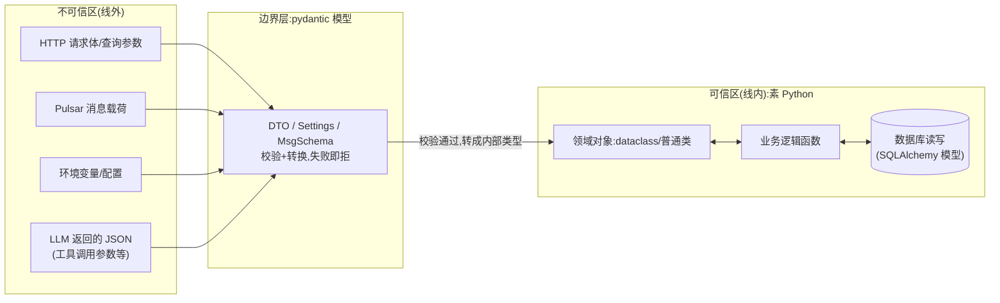

# 边界校验策略：pydantic 守边界，内部素 Python

> Python 重写（feat/python-rewrite）的既定决策之一。本文讲清:这个分层到底指什么、
> 边界具体划在本项目哪几条线上、为什么"到处 pydantic"和"全部手写"都是错的、
> 以及落地时的具体规则与反模式。面向零背景读者,术语表先行。

---

## 1. 术语表

| 名词 | 大白话解释 |
|---|---|
| **pydantic (v2)** | Python 的数据模型库:用类型注解声明数据长什么样,实例化时自动**校验**(类型/范围/必填)并**转换**(如 `"3"`→`3`)。v2 核心用 Rust 写,快。 |
| **BaseModel** | pydantic 模型的基类。继承它的类,字段注解即校验规则。 |
| **校验 / 转换** | 校验=检查数据合不合法;转换=把"裸 JSON 解析出的普通字典"变成"带类型的对象"。 |
| **信任边界（trust boundary）** | 数据从"不可控的外面"进入"我们代码控制的里面"的那条线。线外的数据一律当敌人。 |
| **DTO** | Data Transfer Object,专门用来承接口出入参的数据结构,不含业务逻辑。 |
| **dataclass** | Python 标准库的轻量数据类(`@dataclass`),只有字段和构造,**没有运行时校验**。 |
| **领域对象（domain object）** | 服务内部表达业务概念的对象(如"一次运行 Run"),生死都在我们代码里。 |
| **序列化 / 反序列化** | 对象→JSON 文本 / JSON 文本→对象。 |
| **msgspec / attrs** | pydantic 的两个替代品:msgspec 更快更省内存但生态小;attrs 是老牌数据类增强库。 |
| **422** | FastAPI 校验失败时的标准 HTTP 状态码(Unprocessable Entity),响应体带逐字段错误。 |

---

## 2. 为什么存在这个策略:两个极端各自怎么坏

### 极端 A:全部手写校验(不引库)

直觉是"自己写 if 更清楚"。单字段时成立,规模化后结构性崩塌:

1. **三份真相漂移**:函数签名的类型注解、接口文档、if 链里的实际规则,三处各写一份,改一处忘两处。类型注解说 `task: str`,真实约束(非空、≤255)埋在函数体第 40 行,读代码的人必须通读实现才知道接口长什么样。
2. **错误格式各自发明**:每个接口自己拼错误 JSON,前端要适配 N 种格式;而且手写通常"遇错即返",用户要提交 5 次才能改完 5 个字段错。
3. **嵌套是指数级成本**:`citations: list[Citation]` 这种嵌套列表,手写要递归校验每个元素每个字段;联合类型(`str | int`)、可选嵌套更是灾难。
4. **未声明字段不拦**:恶意的 `{"isAdmin": true}` 手写版默认放进来,除非每个接口都记得写白名单逻辑。
5. 违反本项目全局铁律"外部输入必须 runtime 校验"——手写把铁律的执行散落在每个接口靠自觉,没有机制兜底。

### 极端 B:到处 pydantic(所有类都继承 BaseModel)

反方向同样是坑,而且是 Python 社区这两年集中反思的坑:

1. **为内部调用付校验税**:BaseModel 实例化时**每次都跑完整校验**。服务内部函数之间传个领域对象,数据明明是自己刚从数据库读的、完全可信,也要再校验一遍——纯浪费,热路径上可测量地拖慢。
2. **领域对象被绑上序列化框架**:内部业务类继承 BaseModel 后,它的构造语义、默认值行为、拷贝行为全由 pydantic 定义;哪天想换库(或 pydantic 大版本升级,v1→v2 的迁移之痛社区记忆犹新),**全部业务代码陪葬**。
3. **心智噪音**:满屏 `model_dump()/model_validate()`,读者分不清"这是在防外部输入,还是只是作者习惯性一把梭"。校验语义被稀释后,真正的边界反而不显眼了。

### 结论的形状

校验的价值只产生在**不可信数据进门那一刻**;进门之后数据已经干净,再校验就是重复安检。所以正确做法不是"用不用 pydantic"的二选一,而是**按信任边界分层**:

---

## 3. 本项目的边界具体划在哪(逐条线)

对照重写后的 agent-server,**必须**过 pydantic 的入口一共五类:

| # | 边界 | 为什么不可信 | pydantic 形态 |
|---|---|---|---|
| 1 | **HTTP 出入参**(FastAPI 路由的 request/response model) | 任何人可发任意 JSON | `CreateTaskDto`、`ChatReqDto` 等,response_model 同时约束出参形状(防手滑漏字段/多字段) |
| 2 | **Pulsar 消息载荷** | 消息可能来自旧版本生产者、重放、或将来其他服务 | `RunJobMsg(run_id, user_id)`——消费端 `model_validate_json()` 后才进处理逻辑 |
| 3 | **环境变量/配置** | 部署时人手写的字符串,错了要**启动即炸**而不是运行时炸 | `pydantic-settings` 的 `Settings` 类,进程启动第一件事 |
| 4 | **LLM 返回的结构化内容**(agent 工具调用的参数 JSON) | 大模型输出天然不可靠,幻觉字段/缺字段/类型错是常态 | 每个 tool 的参数 schema 即 pydantic 模型,`model_validate` 失败走"参数错误反馈给模型重试"路径 |
| 5 | **文件上传的元数据**(文件名/MIME/大小) | 用户可伪造 | 上传 DTO + 白名单校验 |

**不过** pydantic 的地方(可信区,素 Python):

- **领域对象**:`Run`、`Chunk` 这类内部实体 → `@dataclass(slots=True)`(slots 省内存、属性拼写错直接 AttributeError)。
- **服务间函数传参**:`ingest(run: Run)` 直接传 dataclass,不做二次校验。
- **SQLAlchemy 模型**:ORM 行对象本身就是内部类型,从库里读出来的数据视为可信(它写入时已过边界),**不要**再套一层 pydantic 才允许业务用——那是常见的"三层模型病"(DTO→pydantic 中间层→ORM,每层互转,代码翻倍)。ORM 对象→响应 DTO 只在**出口**转一次。

---

## 4. 落地规则(写代码时照做)

1. **模型放哪**:每个模块一个 `schemas.py`(边界 DTO)+ `models.py`(SQLAlchemy)+ 领域 dataclass 就近放服务文件。DTO 命名后缀 `Dto`/`Msg`,一眼可辨"这是边界"。
2. **未声明字段一律丢弃**:DTO 基类统一 `model_config = ConfigDict(extra="ignore")`(等价于 Nest 时代的 `whitelist: true`)。
3. **出参也走 model**:FastAPI 路由必须声明 `response_model`,防止 ORM 对象直接序列化把内部字段(如 `password_hash`)漏出去——这是 response_model 的安全价值,不只是文档价值。
4. **转换只发生在边界**:请求进来 DTO→dataclass 一次;响应出去 dataclass/ORM→DTO 一次。中间层禁止来回 `model_dump()`。
5. **配置即启动断言**:`Settings` 里该 required 就 required,禁止 `os.environ.get("X", "默认值")` 散落各处——环境变量拼错要在启动 3 秒内炸,不要在半夜任务跑到一半炸。
6. **LLM 工具参数校验失败不是 bug 是常态**:校验错误信息要回传给模型(它会自我修正),不要直接 500。

## 5. 反模式清单(code review 时逮这些)

| 反模式 | 症状 | 纠正 |
|---|---|---|
| 内部类继承 BaseModel | 服务层/领域层出现 `BaseModel` | 改 dataclass;pydantic 只准出现在 schemas/settings |
| 三层模型病 | ORM→pydantic→DTO 层层互转 | ORM 直用,仅出口转 DTO |
| 边界裸奔 | 路由里 `await request.json()` 手取字段 | 一律声明 DTO 参数 |
| 校验税进热路径 | 循环里反复 `model_validate` 同一批可信数据 | 校验一次,之后传对象 |
| 配置散读 | 业务代码里 `os.environ[...]` | 统一走 Settings 注入 |

## 6. 与替代方案对比(为什么边界层选 pydantic 而非 msgspec/attrs/手写)

| 维度 | pydantic v2 | msgspec | attrs+cattrs | 全手写 |
|---|---|---|---|---|
| 校验能力 | 全(约束/嵌套/联合/自定义) | 强但约束语法较少 | 需自己组装 | 全靠自觉 |
| 性能 | 快(Rust 核心) | **最快**(比 pydantic 快数倍) | 中 | 看写法 |
| FastAPI 集成 | **原生地基**,零胶水 | 需换 Litestar 或写适配 | 需胶水 | 失去框架校验/文档能力 |
| 生态绑定 | OpenAI SDK/LangChain/arq 同款 | 小众 | 中 | 无 |
| OpenAPI 文档 | 自动生成 | Litestar 下可 | 无 | 手写 |
| 结论 | **边界层选它**:不是因为最快,而是与 FastAPI/AI 生态零摩擦 | 若未来某接口成为序列化热点,可单点换它 | 不引入 | 仅内部逻辑 |

一句话总结:**pydantic 是边防军,不是户籍警——只在国境线上查证件,进了城的人自由通行。**
