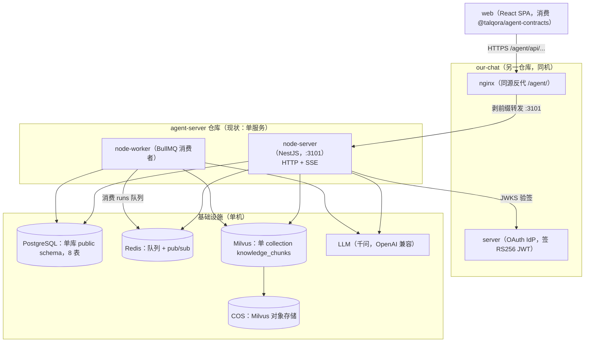
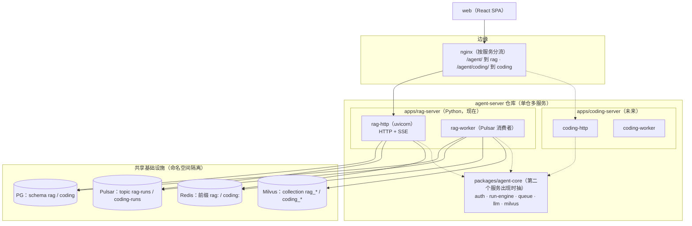
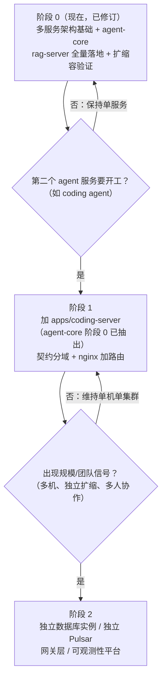

# 01 · 多 Agent 服务目标架构评估

> 背景：`agent-server` 仓库的长期目标不是"一个 RAG 服务"，而是**承载多个 agent 服务**（当前是 RAG 知识库，
> 之后还会有 coding agent 等）。本文评估两件事：① **当前项目结构是否合理、是否符合多服务目标**；
> ② **正在进行的 Python 重写现在要做什么落位，才能不返工**。所有结论落到本仓库的真实结构
> （`apps/` `packages/` `proto/` `docker/` 与部署事实），不空谈。面向零背景读者：先术语表，再分析。

---

## 0. 结论先行（TL;DR）

1. **方向正确，只完成了一半。** 仓库骨架（`apps/` + `packages/` + `proto/` + `docker/` + `docs/`）已经是
   多服务该有的形状；缺的是**服务化纪律**——数据隔离、资源命名空间、契约分域、部署/CI 多服务化。
2. **推荐目标形态：单仓多服务**（monorepo；每个服务一个可独立部署的 app；共享代码走共享库、共享基础设施
   按命名空间隔离）。它不是"单服务多模块"（隔离不够），也不是"多仓 + 平台层"（对当前规模是纯负重）。
3. **拆分原则：无驱动不拆。** 拆分驱动只有四类：**独立扩缩容、隔离（安全/资源/故障域）、独立技术栈、
   团队边界**。**已修订（见《03-多服务架构设计》）：多服务架构基础本期一并落地**（共享库、服务模板、
   独立部署与扩缩容机制）；第二个业务服务的**业务实现**仍待需求——不为无需求的未来写业务代码。
4. **Python 重写现在要做的落位**（本文对重写最直接的输出）：
   - 目录：`apps/rag-server/`（Python）；`apps/node-server/` 保留做对照、不再部署；
   - 资源命名空间：PG schema `rag`、Milvus collection `rag_knowledge_chunks`、Pulsar topic `rag-runs`、
     Redis 频道前缀 `rag:`；
   - 服务内代码按"未来可抽共享库"的边界组织（`shared/` 即候选池），**一期不抽包**；
   - 契约：**proto 补全为全量业务类型的单一来源，Python 侧统一从 proto 生成并使用**（纯增量扩展，
     web 类型包兼容、无需改动）；未来分域规范见 §6.4；
   - 部署：compose 增 `rag-server` / `rag-worker` / `pulsar`（自建）；CI 切 Python。
5. **现在不要做的事**：不建平台层（control plane）、不拆独立数据库实例、不做服务网格、不预抽共享 Python 包。

---

## 1. 术语表（正文用到的名词，先扫一眼）

| 名词 | 大白话解释 |
|---|---|
| **单体（monolith）** | 所有功能打包成一个部署单元（一套进程组、一份镜像）。 |
| **模块化单体** | 单体，但内部按模块严格分边界（模块之间只能走清晰接口）。 |
| **微服务** | 每个功能独立部署、独立扩缩、独立数据；通过网络协作。 |
| **单仓多服务（monorepo services）** | 一个仓库里放多个可独立部署的服务，共享代码与工具链。Google/Uber 等大厂的主流做法。 |
| **服务边界** | 一个服务"管什么、不管什么"的线；跨线只能走约定接口。 |
| **独立部署单元** | 能单独构建、单独启动、单独升级的最小单位。 |
| **控制面 / 数据面（control plane / data plane）** | 控制面=管理调度（注册、路由、配额）；数据面=真正干活的进程。 |
| **共享库（shared library）** | 多个服务共用的代码包（如"验签逻辑"），以库的形式被引用，而不是复制粘贴。 |
| **命名空间隔离** | 多个服务共用同一个中间件实例，但用 schema/前缀/topic 划出各自地盘，互不可见。 |
| **schema-per-service** | 每个服务在同一个 PostgreSQL 实例里拥有自己的 schema（相当于"库中库"）。 |
| **拆分驱动** | 促使你把一个服务拆成两个的真实原因（扩缩容/隔离/技术栈/团队），不是"看起来专业"。 |
| **YAGNI** | "You Aren't Gonna Need It"——现在不需要的东西现在不做，避免为想象中的未来付费。 |
| **uv workspace** | Python 包管理器 uv 的工作区模式（一个仓库多个 Python 包互相引用），对应 Node 的 pnpm workspace。 |
| **联合身份（federated identity）** | 外部 IdP（our-chat）的用户标识 `(issuer, subject)` 映射到本服务本地用户主键的机制。 |

---

## 2. 现状盘点（事实，来自代码与部署）

### 2.1 仓库结构（当前）

```
agent-server/
├── apps/
│   └── node-server/          # 唯一服务：NestJS 单体（HTTP + worker 双入口）
├── packages/
│   └── agent-contracts/      # web 消费的 TS 类型包（proto 生成物）
├── proto/ourchat/agent/v1/   # 契约单一权威（agent 域）
├── docker/                   # dev/prod compose + 部署脚本
└── docs/                     # 方案与决策文档
```

**关键事实**：`apps/` 目前只有一个服务；`packages/` 只有一个 TS 类型包；proto 只有一个域（`ourchat.agent.v1`）；
compose 编排的是"单应用 + 中间件"。

### 2.2 运行时形态

- **双进程单镜像**：`node-server`（HTTP + SSE，:3101）与 `node-worker`（BullMQ 消费者），同镜像不同入口。
- **异步链路**：HTTP 建 run → 入队（BullMQ/Redis）→ worker 消费 → 事件落库（PG）+ 广播（Redis pub/sub）→
  HTTP 进程经 SSE 推给浏览器（断线用 `Last-Event-ID` 从 PG 回放）。
- **数据**：PG 单库 public schema（8 张表）；Milvus 单 collection `knowledge_chunks`（Strong 一致性、
  `user_id` 过滤写死在唯一出口）；Redis（队列 + pub/sub；缓存为预留用途、代码中未实际使用）；
  COS（Milvus 对象存储）。

### 2.3 鉴权与契约

- **鉴权**：our-chat 是 IdP（RS256 JWT，JWKS 验签）；本服务**无状态验签**，`(issuer, subject)` 零接触映射
  本地用户（联合身份）；本地 HS256 登录为开发兜底。
- **契约**：proto（`ourchat.agent.v1`）是权威 → ts-proto 生成两份 TS（node-server 内部 gen + 发布包
  `@talqora/agent-contracts` 给 web）。**对外 JSON 契约（路径/字段/事件名）以 Nest DTO + Swagger 定义**；
  proto 目前主要服务 web 的类型消费（服务端自身只用到 `Citation` 一处）。

### 2.4 部署与 CI

- 单机（与 our-chat 同机）docker compose；our-chat 的 nginx 同源反代 `/agent/` → `:3101`
  （Bearer 鉴权，跨域无鉴权障碍）。
- CI：`deploy.yml`（scp 源码 → 服务器本地构建 node 镜像）+ `proto.yml` / `publish-contracts.yml`
  （契约校验与类型包发布）。

### 2.5 现状图



---

## 3. 目标形态：三种候选与选型

### 3.1 候选 A：模块化单体（所有 agent 能力塞进一个服务，用模块区分）

- **长这样**：`apps/agent-server` 里加 `modules/coding`、`modules/rag`…… 仍然一个部署单元。
- **优点**：最简单；零分布式成本；一次部署全上线。
- **什么时候成立**：多个 agent 的**形态同构**（都是"检索/调 LLM/写数据"），资源画像一致、不需要安全隔离。
- **对本项目的硬伤**：coding agent 大概率要**执行不可信代码**（沙箱）、吃 CPU/长任务，与 RAG 的 IO 画像
  完全不同。塞进同一部署单元后：① 安全隔离做不到（同容器共享一切）；② 扩缩容绑死（RAG 要加副本时
  coding 被迫跟随）；③ 故障域耦合（coding 的内存打爆/沙箱问题会波及 RAG）。

### 3.2 候选 B：单仓多服务（每服务一个独立 app + 共享库 + 共享基础设施按命名空间隔离）【推荐】

- **长这样**：`apps/rag-server`、`apps/coding-server`…… 各自是**独立部署单元**（各自 HTTP + worker、
  各自数据、各自契约域）；共享代码进 `packages/`（如 `agent-core`）；基础设施共用实例但按命名空间隔离。
- **优点**：拿到服务边界（独立部署/扩缩/隔离/演进）的同时，保留 monorepo 的复用与一致性
  （契约、CI、共享库、统一文档）。
- **代价**：需要"服务化纪律"（见 §4）——数据不跨服务直读、资源命名空间、契约分域。
- **业界对标**：大厂 monorepo 微服务；对个人项目是**性价比最高的多服务形态**。

### 3.3 候选 C：多仓微服务 + 平台层

- **长这样**：每个 agent 一个仓库，外加 control plane（服务注册/路由/配额）、网关、可观测性平台。
- **优点**：理论最强隔离与独立演进。
- **代价**：多仓版本同步、跨仓契约管理、平台层开发量——对一人项目是**纯负重**，当前规模收益为零。
- **什么时候值得**：有团队按服务分工、多机部署、需要统一治理时。

### 3.4 对比与拆分驱动

| 维度 | A 模块化单体 | B 单仓多服务（推荐） | C 多仓+平台层 |
|---|---|---|---|
| 隔离（安全/资源/故障域） | ❌ 无 | ✅ 部署级隔离 | ✅✅ 最强 |
| 独立扩缩容 | ❌ | ✅ | ✅ |
| 代码复用 | ✅✅ 最简单 | ✅ 共享库 | ⚠️ 跨仓版本矩阵 |
| 一致性（契约/CI/工具链） | ✅✅ | ✅ monorepo | ⚠️ 各自为政 |
| 当前规模适配 | ✅ 够用但会撞隔离墙 | ✅✅ 刚好 | ❌ 过度 |
| 演进成本 | 未来拆=重构 | 加服务=加 app | 起步即高 |

**拆分驱动（只有这四类，缺一不拆）**：
1. **独立扩缩容**：两个能力的负载曲线完全不同（RAG 是 IO 密集、coding 是 CPU/长任务密集）；
2. **隔离**：安全（沙箱执行不可信代码）、资源（内存/GPU）、故障域；
3. **独立技术栈**：某服务要换语言/运行时；
4. **团队边界**：不同人/组负责不同服务。

> 反过来说：**没有以上驱动时，拆服务 = 付分布式的税、买不到收益**。业界共识是"模块化单体先行，
> 有真实瓶颈再抽服务"（Monolith First）。B 与这条共识不冲突——B 是"按需生长"的：
> 现在只落地第一个服务（rag-server），第二个服务开工时再加 app。

### 3.5 结论

**目标形态 = B（单仓多服务）。** 落地节奏已修订：**多服务架构基础本期一并做掉**（共享库、服务模板、
独立部署/扩缩容机制——设计见《03-多服务架构设计》）；RAG 服务作为第一个服务全量落地；
第二个业务服务的业务实现待需求，接入路径（模板 + checklist）本期备好。

---

## 4. 服务边界设计（一个 agent 服务长什么样）

### 4.1 服务的定义（六件套）

一个 agent 服务 = **① 对外 HTTP/SSE 接口面 + ② 异步 worker + ③ 自有数据 + ④ 自有领域逻辑与工具集
+ ⑤ 独立部署单元 + ⑥ 独立契约域**。缺任何一项，它就不是一个"服务"，而是别的服务的模块。

### 4.2 共享 vs 独有

| 层 | 内容 | 归属 |
|---|---|---|
| 共享代码（未来 `packages/agent-core`） | JWT 验签 + 联合身份、run-engine（事件溯源 + SSE 补发）、队列封装（Pulsar producer/consumer）、LLM 客户端、Milvus 客户端封装、配置/日志模式 | 共享库 |
| 共享基础设施（按命名空间隔离） | PG（schema per service）、Redis（前缀 per service）、Pulsar（topic per service）、Milvus（collection per service）、COS、LLM 端点 | 共享实例 |
| 独有 | 领域数据（表）、工具实现、prompt、领域契约、部署生命周期 | 各服务自己 |

### 4.3 身份与数据隔离规则（两条铁律）

1. **身份锚点是 `(issuer, subject)`，不是本地用户 id。** 每个服务各自把 `(iss, sub)` 映射到**自己的**本地主键；
   跨服务通信绝不携带本地 id（rag 的 user 42 与 coding 的 user 42 毫无关系）。
2. **禁止跨服务读表。** 服务 A 需要服务 B 的数据时，只能走 B 的 API（同步）或事件（异步）；
   数据库层的隔离（schema / 表归属）就是这条规则的物理保证。

### 4.4 资源命名规范（多服务的前提）

| 资源 | 规范 | 示例（RAG 服务） |
|---|---|---|
| PG schema | 每服务一个 schema，表名不加前缀 | `rag.users`、`rag.documents`、`rag.runs` |
| Milvus collection | `<service>_<用途>` | `rag_knowledge_chunks` |
| Pulsar topic | `<service>-runs`（进阶：tenant/namespace 隔离） | `rag-runs` |
| Redis 频道/键 | `<service>:` 前缀 | `rag:run:{runId}` |
| HTTP 路由 | 由 nginx 按服务分流（当前 `/agent/` 先指 RAG） | `/agent/api/...`（未来 `/agent/coding/...`） |
| proto package | `ourchat.<service>.v1`（通用消息另议） | `ourchat.agent.v1`（现状，暂不动） |

### 4.5 目标架构图



---

## 5. 当前项目符合度逐项评估

| # | 项 | 现状 | 多服务目标要求 | 结论 |
|---|---|---|---|---|
| 1 | 仓库结构 | `apps/` + `packages/` + `proto/` + `docker/` | 每服务一个 app、共享进 packages | ✅ 已是对的形状 |
| 2 | 运行时模式 | 双进程单镜像（HTTP/worker 同代码不同入口） | 每服务一套"HTTP+worker" | ✅ 可直接复制为服务模板 |
| 3 | 鉴权 | 无状态 JWKS 验签 + 联合身份 | 各服务独立验签、身份锚点 `(iss,sub)` | ✅ 天然支持（IdP 在外） |
| 4 | 契约 | proto 单域（RAG 专属 + 通用 run 消息混在一起） | 每服务一域 + 通用消息归位 | ⚠️ 需定分域规范（现在不动） |
| 5 | 数据 | 单库 public schema、表无归属、Milvus 无前缀 | schema/collection per service | ❌ 无隔离，需定规范并落地 |
| 6 | 队列 | 将引入 Pulsar，未定命名 | topic per service | ⚠️ 落地时按规范命名 |
| 7 | Redis | 频道 `run:{id}` 无前缀 | 前缀 per service | ⚠️ 加 `rag:` 前缀（零成本） |
| 8 | 部署/CI | compose 单应用、nginx 单路由、CI 单服务 | 多服务编排 + 路由 + CI 可扩展 | ⚠️ 定义"加服务 checklist" |
| 9 | 共享库 | 无（Node 时代全在 app 内） | 第二个服务时抽 | ❌ 一期不抽，边界预留 |

**结论：骨架合理（1–3 已是多服务形状），纪律缺失（4–9）。**
而"没有存量包袱"（无运营数据、无外部消费者）+ "正在全量重写"恰好是**补齐纪律成本最低的窗口**——
如果重写时不落命名空间与边界，等第二个服务出现再改，就要动数据、动契约、动部署。

---

## 6. Python 重写落位建议（现在做什么）

### 6.1 目录与命名

```
agent-server/
├── apps/
│   ├── node-server/          # 保留：对照参考，不再部署（不删）
│   └── rag-server/           # 新增：Python 版 RAG 服务（uv 项目）
│       ├── pyproject.toml
│       ├── src/rag_server/
│       │   ├── api/          # FastAPI 路由（对应 Nest controllers）
│       │   ├── modules/      # 领域模块：documents / conversations / agent / task_sessions / runs
│       │   ├── shared/       # 基座：auth / run_engine / queue / llm / milvus / rag / db / redis（抽库候选池）
│       │   ├── contracts/gen/  # 从 proto 生成（betterproto 系 pydantic dataclass，禁止手改）
│       │   ├── settings.py   # pydantic-settings
│       │   ├── main.py       # HTTP 入口（uvicorn）
│       │   └── worker.py     # worker 入口（Pulsar 消费者）
│       ├── alembic/          # 迁移（无存量数据，直接建全新迁移历史）
│       └── tests/
├── packages/
│   └── agent-contracts/      # 不动（web 消费的 TS 类型包）
└── proto/                    # 不动（契约权威）
```

### 6.2 代码边界（为"抽共享库"预留，但一期不抽）

- `shared/` 里的每个模块（auth / run_engine / queue / llm / milvus）**不依赖 `modules/`**，只依赖配置与
  DB 会话——未来抽 `packages/agent-core` 时一搬就走。
- `modules/` 之间不互相 import（横向只走 `shared/`）——对应"服务内模块边界"。
- **抽包时机（已修订）**：多服务架构本期落地，`packages/agent-core` **本期即抽**（uv workspace）；
  边界纪律不变——core 不 import 服务代码，服务只依赖 core。

### 6.3 资源命名空间落地（具体值）

| 资源 | 现在（Node 版） | rag-server 落地值 |
|---|---|---|
| PG schema | `public` | `rag`（`rag.users` / `rag.documents` / …；Alembic 版本表也放 `rag`） |
| Milvus collection | `knowledge_chunks` | `rag_knowledge_chunks`（无运营数据，改名零成本） |
| Pulsar topic | —（BullMQ） | `rag-runs`（自建 Pulsar 的 default 命名空间；进阶再上 tenant/namespace 隔离） |
| Redis 频道 | `run:{id}` | `rag:run:{id}` |
| HTTP 路由 | `/api/...`（nginx `/agent/` 剥前缀） | **保持不变**（web 零改动；未来加服务时再引入 `/agent/{service}/` 分流） |
| 服务名 | node-server / node-worker | rag-server / rag-worker |

> 注：nginx 的 `/agent/` location 反代目标从 node-server 容器换成 rag-server 容器（路径与协议不变，
> 前端无感）；端口沿用 `:3101`。

### 6.4 契约：proto 补全为全量业务类型 + Python 统一从 proto 生成（已定）

**决策：纠正 Node 版的偏离——所有业务类型从统一 proto 生成并使用。** Node 版实际只有 `Citation`
一处消费生成类型，对外形状由手写 DTO + Swagger 定义，偏离了"proto 是业务类型单一来源"的设计本意；
重写纠正它。

**① proto 补全**（当前缺失的请求/事件/快照类型，纯增量）：

| 类别 | 需新增的消息 |
|---|---|
| 鉴权 | `RegisterReq` / `LoginReq` / `AuthResp`（token + AgentUser） |
| 会话 | `CreateConversationReq`（可选 title）/ `SendMessageReq`（query、可选 topK） |
| 任务 | `CreateTaskReq`（task、sessionId）/ `CreateTaskSessionReq`（可选 title） |
| 事件 | `ChatTokenEvent`（对话 SSE 逐 token 事件） |
| 快照 | `RunSnapshotResp`（run + events） |
| 零散响应 | `RunIdResp`（统一 `{runId}` 形状；demo / 任务提交等） |

已有实体（`AgentUser` / `AgentDocument` / `Citation` / `AgentMessage` / `AgentConversation` /
`ChatDoneEvent` / `RunEvent` / `AgentRun` / `AgentTaskResp` / `AgentTaskSession`）保持不动。

**② Python 生成链路**：`buf.gen.yaml` 增加第三个目标（Python），生成物进
`apps/rag-server/src/rag_server/contracts/gen/`；`proto.yml` 的 freshness 校验增加该路径；
插件走 **betterproto 系（pydantic dataclass 路线）**——生成物是 pydantic dataclass，可直接作为
FastAPI 的请求/响应模型（OpenAPI 自动生成），与"边界 pydantic"的既定策略同源。工具版本实现时钉死
（betterproto2 活跃维护 / betterproto 原版带 `pydantic_dataclasses` 选项，二者择一实测）。

**③ 使用纪律**：
- 边界 DTO = 生成类型（不再手写平行 DTO——那正是要纠正的偏离）；
- ORM 行对象仍是内部类型，出口转换一次为生成类型；
- 内部领域对象可直接用生成类型（它们就是 dataclass），无需再包一层。

**④ 两个实现期必须验证的点（spike）**：
- **JSON 形状**：对外必须保持 camelCase（proto 的 JSON 规范本就是 lowerCamelCase）——验证生成类型
  经 FastAPI 序列化的实际 casing，必要时加全局序列化钩子；
- **值级约束**：proto3 表达不了 min/max/非空（如 query 非空、topK 1–20、密码 8–128）——一期在业务层
  显式校验，未来可选 `buf validate`。

**⑤ 影响面**：proto 为纯增量 → `buf breaking`（FILE 级）通过；web 的 `@talqora/agent-contracts`
出新版本（新增类型，现有 11 个类型不变、web 无需改动）；node-server 的 gen 同步刷新（CI freshness）。

**未来**（第二个服务出现时）：新服务新域 `ourchat.<service>.v1`；通用消息（`RunEvent`/`AgentRun`
这类所有服务都有的）考虑上移为公共域（如 `ourchat.agent.common.v1`）；届时一次性迁移
（消费方只有 web 一个，成本可控）。

### 6.5 部署与 CI

- dev compose：中间件新增 `pulsar`（自建 standalone）；业务仍跑宿主机热重载。
- prod compose：`rag-server` + `rag-worker` + `pulsar`，移除 node 应用服务（node 目录只留源码对照）。
- CI：`deploy.yml` 切 Python（构建 python 镜像）；`proto.yml` / `publish-contracts.yml` 不动。
- nginx：仅换反代目标容器（见 §6.3 注）。

### 6.6 现在明确不做的事

| 不做 | 理由 |
|---|---|
| 建 control plane / 服务注册 / 网关层 | 当前只有一个服务；C 方案的成本现在付不值 |
| 拆独立数据库实例 / 独立 Pulsar 集群 | 单机规模；命名空间隔离已足够，未来换实例只改连接串 |
| 第二个业务服务（coding）的业务实现 | 需求未定；服务模板 + 接入 checklist 本期备好（见《03》） |
| 契约分域/改名（proto 拆域） | web 要跟着改；等第二个服务一并做，一次迁移 |

---

## 7. 演进路线（何时做第二、第三步）



**加服务 checklist（阶段 1 用）**：见《03-多服务架构设计》§7（目录模板 / 命名空间 / 契约域 /
部署两角色 / 路由 / CI / 只依赖 agent-core / 跑扩缩容验证清单）。

**共享库（已修订）**：`packages/agent-core` 本期即抽（多服务基础一期落地）；后续按"只进不退"原则维护——
新模块只有在"两个服务都实际用到"时才进 core。

---

## 8. 待确认决策点（附建议值）

| # | 决策点 | 建议 | 备选 |
|---|---|---|---|
| 1 | 服务目录名 | `apps/rag-server/` | `apps/rag/` 等 |
| 2 | PG 隔离方式 | schema `rag` | 表前缀 `rag_`（更弱）/ 保持 public（不推荐） |
| 3 | Milvus collection | 改名 `rag_knowledge_chunks` | 保持 `knowledge_chunks` |
| 4 | Python 侧 proto 代码生成 | **已定：统一从 proto 生成**（betterproto 系 pydantic dataclass 路线；工具版本实现时钉死；含 2 个 spike） | —（已决策） |
| 5 | Pulsar topic 命名 | `rag-runs`（default 命名空间） | tenant/namespace 隔离（`agent/rag/runs`） |
| 6 | 抽共享库时机 | 第二个服务出现时 | 现在就抽（不推荐） |

---

## 附：相关文档

- 《02-实时进度与任务队列架构评审》——队列（Pulsar）+ 扇出（Redis）+ 事件溯源（PG）的合理性评审（本文的运行时基座篇）
- 《03-多服务架构设计-服务边界与独立扩缩容》——多服务目标架构、独立扩缩容设计与本期落地范围（**本文节奏的修订依据**）
- 《用Python全面重写agent-server的技术利弊分析》——重写总账（`docs/技术方案/`）
- 《agent契约单一来源与类型包分发》——契约治理现状（`docs/技术方案/`）
- 《双进程架构-HTTP与Worker-深度讲解》——双进程模式的原理（`docs/技术方案/`）
