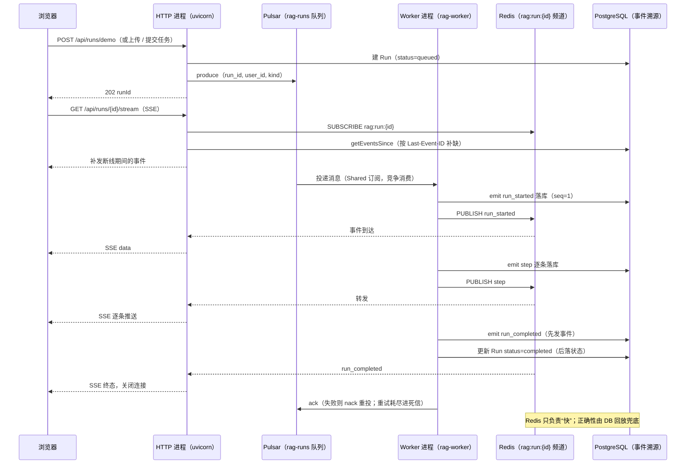

# 02 · 实时进度与任务队列架构评审

> 问题（来自讨论）："**Pulsar 只替换 BullMQ 的任务队列角色；run 进度广播仍走 Redis pub/sub + PG 事件溯源**"
> ——这个架构设计合理吗？是不是业界标准的架构设计？
> 本文给出结论与完整论证：机制拆解 → 职责划分 → 业界对标 → 备选方案对比 → 注意事项与坑。
> 面向零背景读者：先术语表，再分析。

---

## 0. 结论先行（TL;DR）

**合理，而且在这个规模下是标准做法。** 它对应业界一个成熟模式：

> **可靠投递（durable queue）+ 低延迟扇出（ephemeral fan-out）+ 权威状态（source of truth）**

三个组件各司其职，**不是功能重复**：

- **Pulsar**：任务不丢、失败重试、多 worker 竞争消费、死信——队列语义；
- **Redis pub/sub**：毫秒级把事件扇出到所有持有 SSE 连接的副本——通知语义（尽力而为，不承诺送达）；
- **PostgreSQL**：事件日志权威、seq 单调、断线回放、审计——正确性语义。

**成立的根基是一条不变量：正确性不依赖 pub/sub**——pub/sub 只负责"快"，丢了也不影响结果：
客户端断线重连后按 `Last-Event-ID` 从 PG 回放补齐。业界的聊天/推送/流式系统普遍是这个组合
（最广为人知的同构做法是 Socket.io 的 Redis adapter 背板）。

**诚实边界**：两个中间件 = 两个运维面。只有当"实时性"和"可靠性"同时是硬需求时，这个组合才划算——
本项目恰好两者都要（SSE 逐 token 推流 + 文档摄取任务不能丢）。若未来连接层独立成网关
（our-chat 的 gateway 模式），该组合有现成的平滑升级路径（见 §4 方案 B、§5）。

---

## 1. 术语表（正文用到的名词，先扫一眼）

| 名词 | 大白话解释 |
|---|---|
| **队列（queue）** | 一个"待办清单"：生产者放任务，消费者取任务；任务在消费确认前不会丢。 |
| **pub/sub（发布订阅）** | 一个"广播喇叭"：发布者喊一声，所有正在听的订阅者都能听到；没人听就没了。 |
| **扇出（fan-out）** | 一条消息分发给多个接收方（这里指分发给所有持有 SSE 连接的 HTTP 副本）。 |
| **backplane（背板）** | 多个副本之间互相转发消息的中间通道（Redis pub/sub 就是最常见的一种）。 |
| **durable（持久化）** | 消息落盘、进程重启不丢；pub/sub 天生不 durable。 |
| **best-effort（尽力而为）** | 不承诺送达；丢了不报错。 |
| **at-least-once（至少一次）** | 队列的投递语义：保证至少送达一次，代价是可能重复 → 消费方要幂等。 |
| **ack / nack** | 消费者对消息的"确认（处理成功）"/"否定确认（请重发）"。 |
| **死信（DLQ）** | 重试耗尽后消息的去处（留档排查，不再重投）。 |
| **竞争消费（Shared 订阅）** | 多个消费者共用一个订阅，每条消息只投给其中一个（天然负载均衡）。 |
| **事件溯源（event sourcing）** | 把"每一步发生了什么"按序落库（本项目 `run_events` 表），状态可由事件回放。 |
| **seq（sequenceNo）** | 事件在单个 run 内的单调递增序号；断线补发靠它对齐"收到哪了"。 |
| **SSE** | Server-Sent Events，服务器单向推流的长连接；本项目推对话 token 与 run 进度。 |
| **Last-Event-ID** | SSE 协议里浏览器重连时带上的"我最后收到的编号"，服务端据此补发缺口。 |
| **watermark（水位线）** | 去重用的"已发到哪个序号"，保证补发与实时衔接不重不漏。 |

---

## 2. 机制拆解：一条 run 的完整生命周期（重写后的目标形态）

### 2.1 全景时序

**失败分支**（图外补充，重写必须实现）：处理抛错 → `emit run_failed` 落库 + 广播 → `nack` 让 Pulsar 重投；
重投期间前端看到失败事件，重试成功后继续收到后续事件；`(runId, sequenceNo)` 唯一约束防重号。

### 2.2 三个组件各保证什么（职责表）

| 组件 | 保证（必须做） | 不保证（明确不做） | 它挂了会怎样 |
|---|---|---|---|
| **Pulsar** | 任务至少一次投递、失败重试、多 worker 竞争消费（一条消息只被一个 worker 处理）、死信留档 | 不负责把进度推给浏览器 | 新任务积压（不丢）；已有 run 的进度推送不受影响 |
| **Redis pub/sub** | 毫秒级把事件送到所有 HTTP 副本 | **不持久化、不承诺送达**（订阅者不在线就丢） | 实时推送中断；客户端重连后从 PG 补齐（**不丢数据**） |
| **PostgreSQL** | 事件权威日志、seq 单调、断线回放、审计 | 不做实时扇出（轮询它代价高） | 全链路停（核心依赖，必须最稳） |

### 2.3 四条关键不变量（重写时必须保留）

1. **先落库、后广播**（emit 的顺序）：广播失败可以靠回放兜底；没落库的事件永远丢了。
2. **终态先发事件、后落状态**：保证"晚连入的 SSE"总能回放到终态事件（Node 版已如此，重写照搬）。
3. **订阅先于补发 + watermark 去重**：SSE 接入时先 subscribe 再查 `getEventsSince`，期间到达的实时事件
   进 buffer，补缺完成后按水位线去重 flush——保证"补缺 → 实时"无缝不重号。
4. **至少一次 + 幂等**：Pulsar 重投是常态（ack 超时、worker 崩溃）；摄取任务靠"开写前按 document_id
   清场"保持幂等，agent 任务靠事件溯源判断进度。

---

## 3. 为什么这是"标准"组合（业界对标）

**模式名**：durable queue + ephemeral fan-out + source-of-truth event log。它同时出现在多个成熟场景：

| 场景 | 队列（可靠投递） | 扇出（实时通知） | 权威状态（回放） |
|---|---|---|---|
| **本项目的同构前身**（our-chat IM） | 消息先落库即可靠 | Redis pub/sub 背板（网关多副本） | PG 存消息 + 离线补拉（`/sync`） |
| **Socket.io 多副本** | —（聊天消息走 DB） | **Redis adapter**（就是 pub/sub 背板） | DB |
| **通知/推送系统** | Kafka/Pulsar 消费 | WebSocket 网关内存扇出 | DB 存通知 + 客户端拉取补齐 |
| **任务系统（BullMQ/Celery/Sidekiq）** | Redis/RabbitMQ 队列 | 进度要么轮询 DB、要么 pub/sub | DB 记任务状态 |
| **工作流引擎（Temporal 等）** | 任务队列 | 进度查询/流式 | **事件历史**（本项目是轻量自研版） |

**判定标准（为什么不合并成一个组件）**：一个组件如果既要"至少一次投递 + 重试 + 死信"，又要
"动态频道、海量并发订阅、低延迟扇出、无持久化负担"，两边的语义会互相打架。Pulsar 擅长前者、
pub/sub 擅长后者；**权威永远在 DB**。这正是"语义不同"而非"功能重复"。

---

## 4. 备选方案对比（为什么不是别的）

| 方案 | 组成 | 可靠性 | 实时性 | 组件数 | 主要代价 | 何时该选 |
|---|---|---|---|---|---|---|
| **A（推荐）** | Pulsar + Redis pub/sub + PG 事件 | ✅ 高 | ✅ 毫秒级 | 3 | 两个中间件 = 两个运维面 | 实时性与可靠性都是硬需求（本项目） |
| B | 只用 Pulsar（fan-out 用"每副本独立订阅"） | ✅ 高 | ✅ 毫秒级 | 2 | 订阅数随副本增长；ack 语义对纯扇出空转；多副本要在应用层过滤全部事件 | 连接层独立成网关、需要单一消息系统时（未来形态） |
| C | 只用 Redis（Streams 队列 + pub/sub） | ⚠️ 中（重放/死信弱） | ✅ 毫秒级 | 1 | 队列语义靠自研补（消费者组/claim/重试） | 小规模、容忍复杂度低（Node 版 BullMQ 就是这类） |
| D | 只用 DB（轮询进度） | ✅ 高（DB 权威） | ❌ 秒级 | 1 | 延迟大、无效查询多、长轮询占连接 | 低频进度、无实时要求 |

> 说明：B 不是错的，是"未来形态"——当 SSE 连接层从 HTTP 进程独立成**网关服务**时，
> "每个网关副本一个订阅、收全部事件再本地路由"会变成更自然的做法。本项目当前 HTTP 进程直接持有 SSE，
> 用 Redis 按 runId 精确订阅（只收关心的频道）更省。升级路径存在：emit 的广播目标从 Redis 换成 Pulsar，
> **接口（emit/订阅/回放）不变**。

---

## 5. 与"多 Agent 服务"目标的结合（呼应 01）

- **队列**：Pulsar 一个集群，topic 按服务命名（`rag-runs` / `coding-runs`）；每个服务的 worker 是独立消费组。
- **扇出**：Redis 频道按服务加前缀（`rag:run:{id}`）；未来若独立 Redis 实例，前缀退化为无成本兼容。
- **事件溯源**：每服务自有事件表（`rag.run_events`），**禁止跨服务读表**；跨服务协作走 API/事件。
- **连接层演进**：若未来多个服务共用一套 SSE 连接（网关），网关只做"订阅转发"，各服务保持
  "落库 + 广播"不变——**这条边界现在就要守住**（HTTP 进程不产生业务事件，只转发）。

---

## 6. 注意事项与坑（诚实清单）

1. **Redis pub/sub 无持久化** → 断线补发**必须**走 PG 回放（`getEventsSince` + watermark）；重写时这是
   最容易偷懒偷掉的一环（"反正重连会重新订阅"——那样会漏事件）。
2. **Redis 是单点**：它挂了只影响"实时性"，不影响"正确性"（客户端重连补齐）；但体验会退化，
   生产至少开 AOF 持久化与自动重启（dev compose 已开 `appendonly`）。
3. **Pulsar 自建的运维面**：standalone 单进程好起，但吃内存（JVM 约 1~2GB，与 our-chat 同机部署要留量）；
   它是新的单点（队列挂 = 新任务积压）。dev/生产都用容器自建，注意给 `PULSAR_MEM` 限上限。
4. **at-least-once 重投**：ack 超时、worker 崩溃都会重投 → 消费逻辑必须幂等（现有"清场后重写"设计保留）。
5. **SSE 细节**：每条 SSE 连接用独立订阅连接（subscribe 态连接不能再发普通命令）；
   `X-Accel-Buffering: no` + nginx `proxy_buffering off` + 长读超时；心跳防中间设备断连。
6. **频道命名**：按 runId 精确订阅（不做通配订阅）；多服务加前缀防串台。
7. **Pulsar 消息体**：只带定位信息（`run_id`、`user_id`、`kind`），业务状态以 DB 为准——保持 Node 版
   "队列只通知有活要干、内容回查 DB"的设计，避免消息与 DB 不一致。

---

## 7. 结论

**合理，且是本项目规模下的标准做法。** 三个组件的职责划分清晰（可靠投递 / 低延迟扇出 / 权威状态），
正确性锚定在"DB 事件溯源 + 断线回放"上，pub/sub 只做加速器——这是业界同类系统（聊天背板、推送、任务系统）
的通用模式。需要付的代价是两个中间件的运维面，与"SSE 实时 + 任务不丢"两个硬需求相比，这笔账划算。
未来若连接层独立成网关，可平滑升级为"单 Pulsar + 网关扇出"（方案 B），接口不变。

---

## 附：相关文档

- 《01-多Agent服务目标架构评估》——多服务形态与命名空间纪律（本文是它的运行时基座篇）
- 《双进程架构-HTTP与Worker-深度讲解》——现状（Node 版）的机制原理（`docs/技术方案/`）
- 《用Python全面重写agent-server的技术利弊分析》——队列换血（BullMQ→Pulsar）在重写总账中的位置（`docs/技术方案/`）
