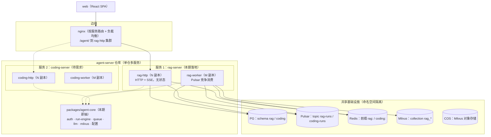
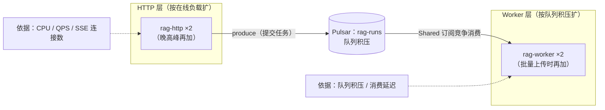
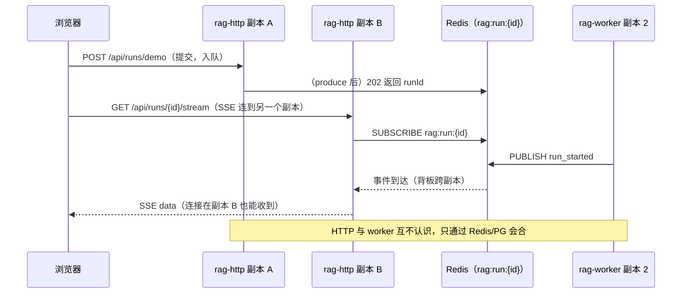

# 03 · 多服务架构设计 —— 服务边界与独立扩缩容

> 决策背景：**多服务（微服务形态）架构本期一并落地**（不再"等第二个服务出现再说"）。
> 本文是"按照架构推进"的权威设计文档：目标形态 → 服务边界与共享层 → **独立扩缩容设计（硬需求）** →
> 部署与 CI → 本期落地范围 → 未来加服务的 checklist。
> 与《01-多Agent服务目标架构评估》的关系：01 的评估结论（单仓多服务、纪律清单）仍然有效，
> 其"按需生长"的**节奏已被本文修订**；本文是落地依据。

---

## 0. 结论先行（TL;DR）

1. **目标形态：单仓多服务（monorepo）+ 共享库（`packages/agent-core`）+ 共享基础设施（命名空间隔离）**。
   每个服务 = 独立部署单元（HTTP 角色 + worker 角色），可独立构建、部署、扩缩、回滚。
2. **硬需求：独立扩缩容**。设计上落到三件事：
   - **HTTP 角色无状态**：任何副本可服务任何请求；SSE 连接靠 **Redis 背板**跨副本收事件；
   - **worker 角色竞争消费**：Pulsar Shared 订阅，副本数 = 消费能力，天然不重复处理；
   - **两层两条独立曲线**：HTTP 按在线负载（CPU/QPS/SSE 连接数）扩；worker 按队列积压扩。
3. **本期落地范围（明确边界）**：
   - 做：`packages/agent-core` 共享库（本期即抽）、服务模板、rag-server 全量功能、
     部署/CI/路由/命名规范、**独立扩缩容验证**（rag-http ×2 + rag-worker ×2 实跑验证）；
   - 不做：第二个业务服务的**业务实现**（需求未定；模板 + checklist 本期备好）；
     K8s/KEDA（设计给出、单机 compose 先行）；平台层/服务网格（无驱动，仍不做）。
4. **诚实说明**：单服务阶段就搭多服务基础，是提前支付"共享库 + 模板 + 部署复杂度"的成本；
   收益是未来加服务零重构、独立扩缩容现在就能成立。项目无运营包袱、边界已定，这笔账可控——
   但**范围必须控制在"骨架与纪律"，不建平台层**。

---

## 1. 术语表（先扫一眼）

| 名词 | 大白话解释 |
|---|---|
| **服务（service）** | 独立部署单元：自有接口面、自有 worker、自有数据、独立生命周期（见 §3.1 六件套）。 |
| **角色（role）** | 服务内部的两种进程形态：HTTP（接请求/持 SSE 连接）与 worker（后台消费任务）。 |
| **副本（replica）** | 同一角色跑几份进程实例；副本数 = 扩缩容的直接手段。 |
| **无状态（stateless）** | 进程内不保存"只有它知道"的业务状态；任何副本都能接任何请求。 |
| **会话保持（sticky session）** | 把同一用户的请求固定打到同一副本；无状态设计**不需要**它（SSE 除外——连接建立后天然固定在那个副本，但事件靠背板送得到）。 |
| **背板（backplane）** | 副本之间转发实时消息的中间通道（本项目用 Redis pub/sub）。 |
| **竞争消费（Shared 订阅）** | 多个 worker 共用一个 Pulsar 订阅，每条消息只投给其中一个 → 副本数即消费能力。 |
| **队列积压（backlog）** | 队列里等待处理的消息数；worker 扩缩容的核心指标。 |
| **HPA / KEDA** | K8s 的自动扩缩器：HPA 按 CPU 等指标；KEDA 可按队列积压这类业务指标扩缩（可缩到 0）。 |
| **优雅退出（graceful shutdown）** | 收到停止信号后，先把进行中的活干完/交还，再退出（不腰斩任务、不丢消息）。 |
| **连接池（connection pool）** | 进程到数据库的连接复用池；多服务/多副本时要做总量预算。 |
| **命名空间隔离** | 共享中间件里按服务划地盘（PG schema / Redis 前缀 / Pulsar topic / Milvus collection）。 |

---

## 2. 目标架构总览



**读图要点**：
- 每个服务对外只有一条入口（经 nginx 按服务路由），对内由"HTTP 角色 + worker 角色"构成；
- 角色之间**不直接通信**：任务走 Pulsar、进度走 Redis pub/sub、权威状态走 PG（见 02 文档）；
- 共享基础设施**一个实例、多个命名空间**（schema/topic/前缀/collection），不跨服务直读（铁律见 §3.3）；
- `agent-core` 是所有服务共用的代码库（认证/运行引擎/队列/LLM/向量库封装），服务只写自己的领域逻辑。

---

## 3. 服务定义与共享层

### 3.1 服务的六件套（复述 01 的定义，作为准入标准）

一个服务 = **① 对外 HTTP/SSE 接口面 + ② 异步 worker + ③ 自有数据 + ④ 自有领域逻辑与工具集
+ ⑤ 独立部署单元 + ⑥ 独立契约域**。

### 3.2 服务契约（每个服务必须遵守的约定）

| 项 | 约定 | 示例（rag-server） |
|---|---|---|
| HTTP 前缀 | `/api` 之下；nginx 按服务剥前缀路由 | `/api/documents` |
| 健康检查 | `GET /api/health`（并行探活依赖，返回 `{status, details}`） | 与 Node 版同形状 |
| SSE 约定 | 事件名/`Last-Event-ID` 补发/`?access_token=` 兜底（与 web 端既有约定一致） | `run_started` / `step` / `run_completed` |
| 队列 | 每服务独立 topic；消息只带定位信息（`run_id`/`user_id`/`kind`） | `rag-runs` |
| 实时频道 | 每服务前缀（`<service>:`） | `rag:run:{id}` |
| 数据 | 每服务独立 PG schema / Milvus collection | `rag.*` / `rag_knowledge_chunks` |
| 契约域 | proto `ourchat.<service>.v1`（当前 rag 域沿用 `ourchat.agent.v1`） | — |
| 配置 | pydantic-settings，启动即校验；服务内统一 `Settings` | — |
| 日志 | 带服务名与角色名（`rag-http` / `rag-worker`），便于单机多服务排障 | — |

### 3.3 共享层：`packages/agent-core`（本期即抽）

| 进 agent-core（多服务公共基座） | 不进（各服务自己） |
|---|---|
| JWT 验签 + 联合身份映射 | 领域模型/表结构 |
| run-engine（事件溯源 + SSE 补发 + Redis 广播） | 领域工具与 prompt |
| 队列封装（Pulsar producer/consumer、ack/nack、优雅退出） | 领域契约与路由 |
| LLM 客户端（OpenAI 兼容，chat/stream/tools/embed） | 领域配置项 |
| Milvus 客户端封装（含"user 过滤唯一出口"的检索纪律） | — |
| 配置基类（pydantic-settings 公共项）、日志、健康检查基座 | — |

**边界纪律**：agent-core 不 import 任何服务代码；服务 import agent-core（uv workspace path 依赖）。
**铁律**（复述 01 §4.3）：身份锚点是 `(issuer, subject)`；**禁止跨服务读表**，协作只走 API/事件。

---

## 4. 独立扩缩容设计（本文核心）

### 4.1 两个角色、两条曲线

| 角色 | 扩缩依据（指标） | 扩的方式 | 副本间关系 |
|---|---|---|---|
| **HTTP（rag-http）** | CPU / QPS / 并发 SSE 连接数 | 加副本 + nginx 负载均衡 | 无状态、互不认识；SSE 连接固定在单个副本，事件靠背板送达 |
| **worker（rag-worker）** | 队列积压 / 消费延迟 | 加副本（Pulsar Shared 订阅竞争消费） | 每条消息只投一个副本；副本间互不认识 |



两条曲线**互不绑定**：批量上传 100 个文档时只加 worker（HTTP 纹丝不动）；晚高峰只加 HTTP（worker 闲着）。

### 4.2 让"独立扩缩"成立的三个机制

1. **状态外置**：业务状态在 PG；进度事件在 PG（回放）+ Redis（实时）。进程内存里没有"只有它知道"的状态。
2. **SSE 背板（跨副本收事件）**：worker 把事件广播到 Redis 频道 `rag:run:{id}`，
   所有 HTTP 副本都订阅该频道 → **连接在哪个副本，都能收到任意 worker 的事件**：



3. **竞争消费（不重复处理）**：worker 多副本共享一个 Pulsar 订阅，Pulsar 保证每条消息只投给一个副本；
   叠加"至少一次 + 幂等"（摄取开写前清场、事件溯源判进度），重投也不会写坏数据。

### 4.3 优雅退出与滚动更新（扩缩容的必答题）

| 角色 | 停止时做什么 | 不这么做会怎样 |
|---|---|---|
| **rag-http** | 停止接新请求；进行中的请求收尾；SSE 连接断开后由客户端**重连带 `Last-Event-ID`** → 另一副本从 PG 补发 | 硬杀会打断 SSE；但因为有回放兜底，**丢不了数据**（体验短暂闪断） |
| **rag-worker** | 停止拉新消息 → 把手头消息处理完并 ack → 关闭 consumer 退出 | 硬杀会腰斩任务；靠 nack 重投 + 幂等兜底，但会重复计算、延迟完成 |

实现要点：compose 配 `stop_grace_period`（≥ 单任务最长耗时，或接受重投）；K8s 未来用
`terminationGracePeriodSeconds` 同义。

### 4.4 扩缩操作：现在（单机 compose）→ 未来（K8s）

**现在（本期）**——同一 compose 里每角色是独立 service，直接指定副本数：

```bash
# 批量上传积压：worker 开到 4，HTTP 保持 2
docker compose up -d --scale rag-http=2 --scale rag-worker=4
```

前置条件（本期落地时必须满足）：
- **不写死 `container_name`**（写死名字无法多副本——Node 版踩过这个坑，见技术方案《双进程架构》§5.2）；
- nginx 对多副本的负载均衡（upstream 指向 compose service 名，扩容后 reload）；
- 每角色独立资源限制（`deploy.resources` / `mem_limit`），防一个角色打爆整机。

**未来（K8s）**——每角色一个 Deployment：
- `rag-http` Deployment + **HPA**（CPU/QPS/连接数）；
- `rag-worker` Deployment + **KEDA**（按 Pulsar 积压扩缩，空闲可**缩到 0**）。

### 4.5 独立性的边界与容量预算（诚实清单）

"独立扩缩"不等于无限：共享资源是天花板，设计时要留预算——

| 共享资源 | 约束 | 本期对策 |
|---|---|---|
| PG 连接数 | 每副本连接池 × 副本数 × 服务数 ≤ PG `max_connections` | 每副本池设上限；写进部署文档 |
| Pulsar 吞吐 | 单 topic 吞吐上限（可加分区） | 单机规模足够；积压指标留给 KEDA 未来用 |
| Redis 连接 | **每条 SSE 连接占一个订阅连接**（订阅态连接不可复用） | 本期可接受；连接数成为瓶颈时改"每副本共享订阅 + 本地路由"（预留演进项） |
| 单机 CPU/内存 | 多服务同机，扩副本很快撞到整机上限 | 本期单机；真隔离=拆机/上 K8s（阶段 2） |

---

## 5. 部署拓扑与 CI

### 5.1 部署拓扑（单机 compose，本期）

```
docker compose（agent-server 侧）：
  中间件：postgres / redis / pulsar（自建 standalone）/ etcd+minio+milvus（dev 用 minio，prod 用 COS）
  服务：  rag-http（可 --scale N） / rag-worker（可 --scale M）
路由：  our-chat nginx（同源反代 /agent/）→ rag-http 集群；未来 /agent/coding/ → coding-http
```

### 5.2 CI（按服务路径过滤）

- `deploy.yml` 改为 Python 构建；按 `apps/rag-server/**`、`packages/agent-core/**` 路径触发；
- 契约流水线（`proto.yml` / `publish-contracts.yml`）不变，freshness 校验增加 Python 生成物路径；
- 未来加服务：新服务一条 path 过滤 + 构建条目（或 matrix），部署脚本按服务名参数化。

---

## 6. 本期落地范围（做掉什么、不做什么）

### 6.1 做

| # | 项 | 说明 |
|---|---|---|
| 1 | `packages/agent-core`（Python，uv workspace） | 本期即抽：auth / run-engine / queue / llm / milvus / 配置 / 日志 / 健康基座 |
| 2 | 服务模板 | `apps/_template/`（或脚手架脚本）：新服务 = 复制 + 改命名空间 |
| 3 | `apps/rag-server` 全量功能 | 对齐 Node 版：21 条路由 + 2 条 SSE + 摄取 + agent + 鉴权（详见重写路线图） |
| 4 | 契约：proto 补全 + Python 生成目标 | 对齐"统一从 proto 生成"决策（见 01 §6.4） |
| 5 | 部署：compose（含 pulsar）+ nginx 路由 + CI | 每角色独立 service、可 --scale、独立资源限制 |
| 6 | **独立扩缩容验证** | 见 6.2 验证清单 |

### 6.2 验证清单（"独立扩缩容"的验收标准）

1. **跨副本 SSE**：run 在 rag-http 副本 A 提交、SSE 连到副本 B → 事件照常收到（背板生效）；
2. **竞争消费不重复**：rag-worker ×2 下提交 N 个 run → 全部完成，每个 run 的事件 seq 连续无重复；
3. **两层互不影响**：单独扩 worker（批量场景）不重启 HTTP；单独扩 HTTP（晚高峰场景）不影响 worker 消费；
4. **滚动重启不丢**：重启 worker 期间的 run 靠 nack 重投完成；重启 HTTP 期间 SSE 客户端重连补发不漏事件。

### 6.3 不做（明确边界）

| 不做 | 理由 |
|---|---|
| 第二个业务服务（coding）的业务实现 | 需求未定；模板 + §7 checklist 已备好，需求来了照做 |
| K8s / KEDA / 服务网格 / 平台层 | 设计已给（§4.4/§4.5）；单机 compose 先跑通，规模信号出现再上 |
| 独立数据库实例 / 独立 Pulsar 集群 | 命名空间隔离已够；未来换实例只改连接串 |

---

## 7. 服务接入 checklist（未来加服务照做）

1. **目录**：`apps/<service>-server/`（从 `_template` 复制）；
2. **命名空间**：PG schema、Pulsar topic（`<service>-runs`）、Redis 前缀（`<service>:`）、Milvus collection（如需）；
3. **契约**：新 proto 域 `ourchat.<service>.v1`（或复用公共域）+ 生成目标 + 类型包版本；
4. **部署**：compose 两角色（http/worker）+ 资源限制 + 健康检查 + `stop_grace_period`；
5. **路由**：nginx 新 location（`/agent/<service>/`）；
6. **CI**：path 过滤 + 构建/部署条目；
7. **共享**：只依赖 agent-core；跨服务协作走 API/事件（禁跨服务读表）；
8. **验证**：跑 §6.2 的独立扩缩容验证清单。

---

## 8. 与其他文档的关系

| 文档 | 定位 |
|---|---|
| 《01-多Agent服务目标架构评估》 | 现状评估 + 服务化纪律清单（结论有效；**节奏已由本文修订**） |
| 《02-实时进度与任务队列架构评审》 | 队列（Pulsar）+ 扇出（Redis）+ 事件溯源（PG）的合理性评审（本文 §4.2 的机制依据） |
| **本文（03）** | **权威架构与落地依据**：服务边界、独立扩缩容、部署与本期范围 |
| 《用Python全面重写agent-server的技术利弊分析》 | 重写总账（`docs/技术方案/`） |
| 《双进程架构-HTTP与Worker-深度讲解》 | 双进程模式的原理与多副本踩坑（`docs/技术方案/`） |
